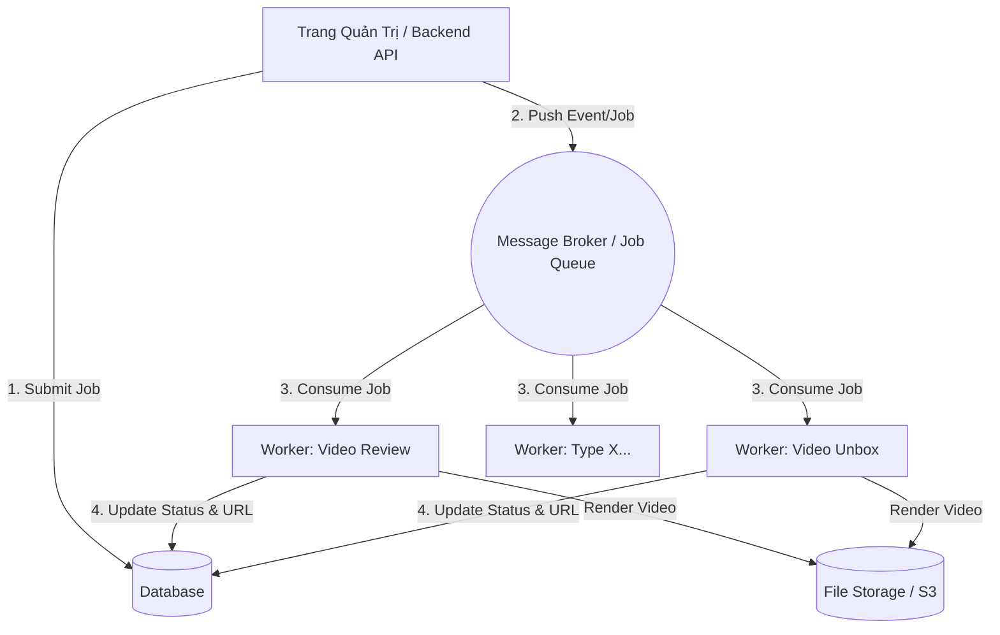

# Tài liệu Kiến trúc Hệ thống Tự động hoá Video (Event-Driven & Job Queue)

Dựa trên yêu cầu của bạn về một trang quản trị tập trung, kiểm soát nhiều loại video (review, unbox,... như các "phích cắm" riêng biệt), và cần sự ổn định, mượt mà nhất. Dưới đây là đề xuất kiến trúc **Tối ưu - Đơn giản - Dễ mở rộng**.

## 1. Tổng quan Kiến trúc (Architecture Overview)

Hệ thống sẽ được chia làm 3 thành phần chính để đảm bảo khả năng mở rộng và không bị nghẽn (non-blocking) khi render video (vốn tốn nhiều tài nguyên CPU/RAM):



## 2. Các Thành Phần Cốt Lõi (Core Components)

### A. API / Admin Panel (Producer)
- **Nhiệm vụ**: Cung cấp UI cho người dùng cấu hình kịch bản (input.json), quản lý file raw, xem trạng thái video.
- **Xử lý**: Khi user bấm "Tạo Video", API không trực tiếp render video. Nó chỉ tạo 1 bản ghi vào Database (Status: `PENDING`), sau đó ném một tin nhắn (Event/Job) vào Message Broker.
- **Công nghệ gợi ý**: FastAPI (Python), Node.js, v.v.

### B. Message Broker & Job Queue
Vì việc render video là tác vụ nặng (long-running task), sử dụng Job Queue truyền thống kết hợp kiến trúc sự kiện là phù hợp nhất.
- **Lựa chọn tối ưu nhất**: **Redis + Celery** (rất mạnh cho hệ sinh thái Python) hoặc **Redis + RQ (Redis Queue)** (đơn giản, dễ setup hơn Celery).
- **Lưu lượng**: Broker chứa các hàng đợi, ví dụ hàng đợi chung `video_jobs` hoặc hàng đợi riêng cho từng server mạnh/yếu khác nhau.

### C. Worker Nodes (Consumers / "Phích cắm")
Worker là các service chạy nền, liên tục lắng nghe Job Queue. Khi có Job mới, Worker nhận lấy xử lý.
- **Kiến trúc Plugin ("Phích cắm")**: Worker có một `Router` (Bộ điều hướng). Dựa vào thẻ `type` của Job (ví dụ: `review`, `unbox`), Worker sẽ gọi đến module xử lý tương ứng.
- **Cô lập lỗi**: Nếu một video render bị lỗi (do thiếu file, lỗi FFmpeg), Worker sẽ catch Exception, báo Update status thành `FAILED` lên DB và tiếp tục làm Job tiếp theo, không làm chết cả hệ thống.

## 3. Luồng Sự kiện Render (Event Flow)

1. **[Trang quản trị]**: User nhập thông tin video loại `review`. Bấm "Tạo".
2. **[API]**: Lưu vào Database: `Job ID: 123, Type: review, Status: PENDING`.
3. **[API]**: Đẩy event đẩy vào Redis Queue: `{"job_id": 123, "type": "review", "config": {...}}`. API lập tức trả ảnh phản hồi "Đang xử lý" cho user (Không bắt đợi).
4. **[Worker]**: Máy chủ Worker A đang rảnh rỗi, bốc Job 123 ra từ Redis Queue. 
   - Worker cập nhật DB: `Status: PROCESSING`.
   - Worker kiểm tra `type == 'review'`, cắm phích gọi hàm [build_video(config)](file:///Users/dangtung/projects/video-creater/video-review/video_builder.py#265-268) của project `video-review`.
5. **[Code Review]**: Chạy FFmpeg, MoviePy... tạo ra `output.mp4`.
6. **[Worker]**: Nhận kết quả file video, lưu file vào Storage (hoặc copy vào thư mục chung).
7. **[Worker]**: Cập nhật DB: `Status: SUCCESS, File_URL: /path/to/video`. Và hoàn thành Job. Ngay lúc này, Trang Quản Trị hiển thị Done.

## 4. Tại sao Kiến trúc này Tối ưu & Mượt mà?

1. **Bất đồng bộ (Asynchronous)**: API và Admin web luôn nhanh nhẹn mượt mà vì nó không phải trực tiếp xử lý Video.
2. **Khả năng Mở rộng (Scalable / Plugin)**:
   - Thêm "Loại Video" mới cực kỳ dễ: Chỉ cần code thêm 1 folder `video-x`, vào code Worker thêm 1 dòng `if type == 'x': run_x()`. Trang Admin thêm 1 Dropdown chọn type là xong.
   - Khi hệ thống nhiều việc quá: Chỉ cần bật thêm nhiều máy chủ chạy Worker. Các Worker sẽ tự chia nhau bốc Job từ Redis (không bị trùng lặp).
3. **Độ ổn định (Resilience)**: 
   - Lỗi render 1 clip không làm chết luồng chính.
   - Thử lại tự động (Auto-Retry): Nếu Job thất bại do lỗi mạng tải file, Job Queue (Celery/RQ) hỗ trợ chức năng retry dễ dàng.

## 5. Cấu trúc Thư mục Hệ thống Đề xuất (Monorepo)

Để setup như các "phích cắm" chung trong 1 hệ thống, bạn nên tổ chức lại cấu trúc một chút:

```text
video-creator-platform/
├── admin-api/             # Web API (FastAPI/Nodejs)
├── worker/                # Worker Service (Celery/RQ)
│   ├── main_worker.py     # Lắng nghe Queue, Router chuyển hướng các type
│   └── ...
├── plugins/               # Nơi chứa các "phích cắm"
│   ├── video-review/      # Code video_builder.py hiện tại của bạn
│   └── video-unbox/       # Code make_viral.py hiện tại của bạn
├── docker-compose.yml     # Chạy DB, Redis, API, Worker lên cùng lúc
└── requirements.txt
```

## Câu hỏi cần bạn xác nhận:
1. Bạn có muốn sử dụng **Redis + Celery** kết hợp **FastAPI** (Python) cho chuẩn hệ sinh thái Python hiện tại của bạn không?
2. Bạn muốn lưu trạng thái job qua database nào? (PostgreSQL, MySQL, hay dùng MongoDB/SQLite cho đơn giản ban đầu?)
3. Nếu bạn OKE với thiết kế này, tôi sẽ tiến hành tạo khung hệ thống (Worker + API) để bạn có thể ráp 2 folder hiện tại vào như 2 plugin.
