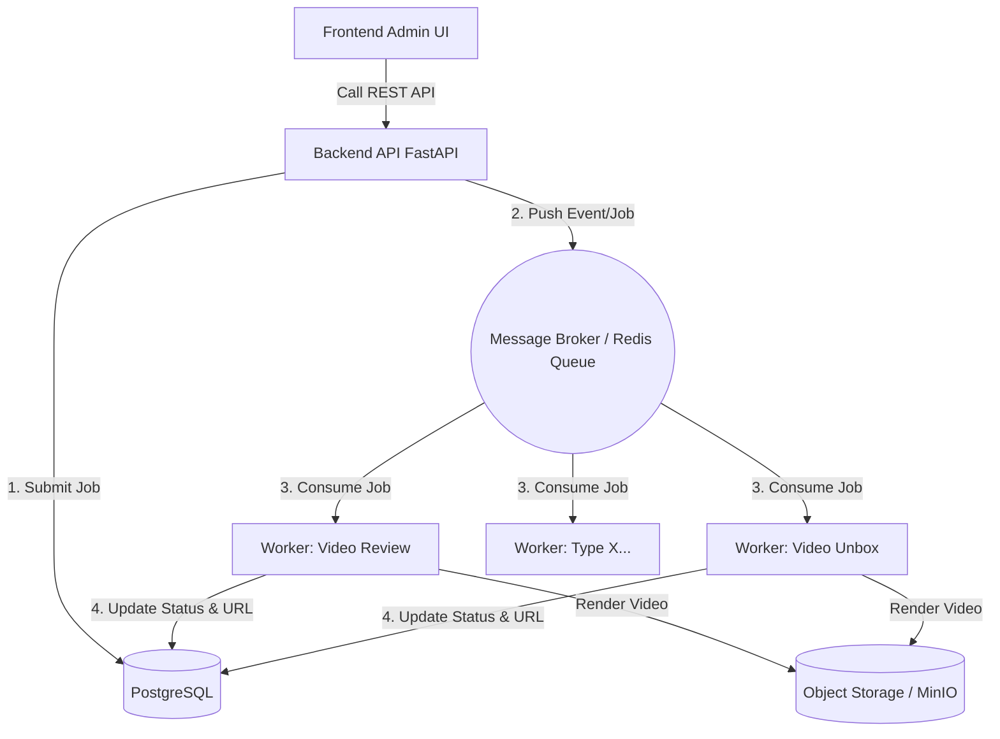

# Kiến Trúc Hệ Thống (Event-Driven & Job Queue)

Dưới đây là thiết kế chi tiết về một trang quản trị tập trung, kiểm soát nhiều loại video (review, unbox,... như các "phích cắm" riêng biệt), đảm bảo sự ổn định, mượt mà và dễ dàng mở rộng nhất.

## 1. Tổng quan Kiến trúc (Architecture Overview)

Hệ thống chia làm 3 thành phần chính để không bị nghẽn (non-blocking) khi render video (vốn tốn nhiều tài nguyên CPU/RAM):

## 2. Các Thành Phần Cốt Lõi (Core Components)

### A. API / Admin Panel (Producer)
- **Nhiệm vụ**: Cung cấp các endpoint cho Frontend UI cấu hình kịch bản (JSON), quản lý file Asset (ảnh, video raw), Project và quản lý Pipeline xử lý. 
- **Đặc tả hoạt động**: Khi user gửi yêu cầu "Tạo Video", API không trực tiếp render video. Nó tạo 1 bản ghi vào DB với trạng thái `PENDING`, đồng thời ném một tin nhắn JSON (Job) vào Celery Task Queue.
- **Công nghệ**: FastAPI (Python), SQLAlchemy ORM, Pydantic, uvicorn.

### B. Message Broker & Job Queue
Render video là tác vụ nặng (long-running task), sử dụng Job Queue kết hợp kiến trúc sự kiện Event-Driven.
- **Dịch vụ môi giới (Broker)**: Redis.
- **Thư viện Job Queue**: Celery. API đóng vai trò là nhà xuất bản (publisher), điều phối luồng xử lý tới các queue cụ thể (ví dụ `review_queue`, `unbox_queue`).

### C. Worker Nodes (Consumers / "Phích cắm")
Worker là các service chạy nền, liên tục lắng nghe hàng đợi (Queue) từ Broker.
- **Kiến trúc Plugin ("Phích cắm")**: Worker chia tách độc lập theo mục đích cấu hình video (`worker_review`, `worker_unbox`). Each worker process runs its specific business logic based on a shared configuration contract (`worker_base.py`).
- **Cô lập lỗi**: Sử dụng cơ chế `try/except` cùng tính năng `max_retries` của Celery. Nếu render 1 clip thất bại, bắt lỗi và cập nhật Database thành `FAILED`, đảm bảo không chết chuỗi tiến trình chung.

### D. File Storage Backend
Sử dụng S3 protocol qua MinIO (Tương đương Amazon S3).
- Lưu trữ mọi dữ liệu tĩnh: Ảnh, nhạc, Clip raw gốc, Video render output thành phẩm.
- Truy cập thông qua cơ chế S3 Presigned URL bảo mật.

## 3. Luồng Sự kiện Render (Event Flow)

1. **[Trang quản trị]**: User thiết lập thông số input video (VD: `review`). Nhấn "Chạy Job".
2. **[API]**: Lưu vào Database PostgreSQL: `Job ID: 123, Type: review, Status: PENDING`.
3. **[API]**: Gửi đẩy task vào Celery (kết nối với Redis): Task yêu cầu thực hiện payload JSON. API phản hồi ngay lập tức cho User.
4. **[Worker - Review]**: Có rảnh tài nguyên, Celery lấy Job 123 từ Queue. 
   - Đổi `Status: PROCESSING`.
   - Download tài nguyên video/raw gốc từ Storage (MinIO) về thư mục `/tmp` local.
5. **[Render Algorithm]**: Tool sử dụng FFmpeg, WhisperX, MoviePy để dựng timeline và xuất file `final.mp4`.
6. **[Worker]**: Đẩy `final.mp4` ngược lại MinIO/S3 Storage theo Object URL path phân mảnh của User/Project.
7. **[Worker]**: Cập nhật DB: `Status: SUCCESS`, kèm `Result_URL`. Hệ thống hoàn thành khép kín. 

## 4. Tại sao Tối ưu & Mượt mà?

1. **Bất đồng bộ hoàn toàn (Fully Asynchronous)**: Frontend và Admin API không bao giờ đứng chờ hệ thống sinh Video.
2. **Khả năng Mở rộng (Scalable / Plugin-ready)**: Thêm loại video mới chỉ cần viết file `worker_x` và inject logic của mình. 
3. **Độ Ổn định cao (Resilience)**: Cơ chế Retry tích hợp chung. Code common được tái sử dụng qua `shared_core`.
