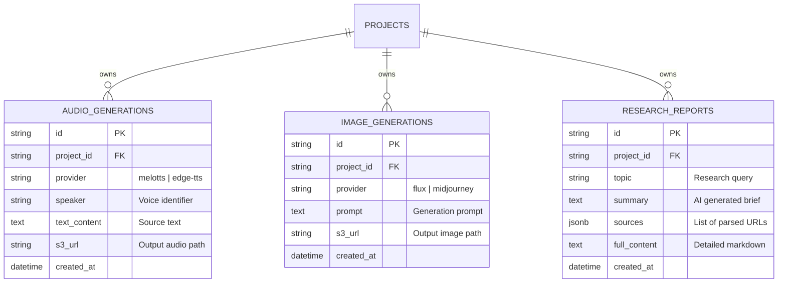

# Báo cáo Kiểm toán Cơ sở Dữ liệu & Thiết kế Hệ thống Workers (Database & Workers Audit Report)

**Tác giả:** Kỹ sư Thiết kế Hệ thống & Kỹ sư Dữ liệu (System Architect & Data Engineer)  
**Mục tiêu:** Rà soát toàn bộ cấu trúc Cơ sở dữ liệu (`shared_core/models.py`) và luồng hoạt động của tất cả các Workers hiện tại nhằm đánh giá tính hợp lý, chỉ ra các điểm bất cập (anti-pattern) và đề xuất phương án khắc phục chuẩn doanh nghiệp.

---

## 1. Đánh Giá Tổng Quan (Executive Summary)

Sau khi rà soát toàn bộ tệp định nghĩa thực thể SQLAlchemy ORM (`shared_core/models.py`) và cách các Workers tương tác với cơ sở dữ liệu, chúng tôi phân loại kiến trúc dữ liệu của các Worker thành hai nhóm chính:

```
┌─────────────────────────────────────────────────────────────────────────┐
│                     Hệ thống Workers & Cơ sở dữ liệu                     │
└─────────────────────────────────────────────────────────────────────────┘
        │
        ├─► Nhóm A: Thiết kế CHUẨN & HỢP LÝ (Highly Optimal)
        │    ├── worker_review, worker_unbox, worker_slideshow, worker_promotion
        │    ├── worker_translify
        │    ├── worker_download (Dùng riêng `download_jobs`)
        │    └── worker_agent (Dùng riêng `agent_sessions` & `agent_logs`)
        │
        └─► Nhóm B: Thiết kế CHƯA TỐI ƯU & Sai ngữ nghĩa (Sub-optimal)
             ├── worker_tts (Chuyển văn bản thành giọng nói - audio)
             ├── worker_text2img (Tạo ảnh tĩnh qua FLUX AI - image)
             └── worker_research (Tìm kiếm & thu thập tri thức - text)
```

---

## 2. Kiểm Toán Chi Tiết Từng Worker

### Nhóm A: Thiết kế CHUẨN & HỢP LÝ (Highly Optimal)

#### 1. Các Worker dựng video chuyên dụng (`worker_review`, `worker_unbox`, `worker_slideshow`, `worker_promotion`)
* **Bảng dữ liệu sử dụng:** `video_jobs` (Model: `VideoJob`) & `job_logs` (Model: `JobLog`).
* **Đánh giá thiết kế:** **XUẤT SẮC / ĐẠT CHUẨN.**
* **Lý do:** Đây là các tác vụ dựng hình, biên tập video thực sự. Các tác vụ này tiêu tốn rất nhiều tài nguyên (CPU/GPU), chạy bất đồng bộ trong thời gian từ 1 đến 15 phút và trả về sản phẩm đầu ra là một tệp video hoàn chỉnh (`result_url` liên kết trực tiếp tới S3/MinIO). Việc theo dõi bằng Celery và lưu trạng thái PENDING/PROCESSING/SUCCESS trong bảng `video_jobs` là hoàn toàn chính xác về mặt nghiệp vụ.

#### 2. Worker dịch thuật và lồng tiếng video (`worker_translify`)
* **Bảng dữ liệu sử dụng:** `video_jobs` (với `job_type = "translify"`).
* **Đánh giá thiết kế:** **HỢP LÝ.**
* **Lý do:** Translify là một quy trình cực kỳ phức tạp bao gồm: tách giọng, chạy OCR trích xuất chữ, dịch ngôn ngữ, chạy TTS tạo tiếng Việt và tổng hợp lại vào video gốc. Đây là một tác vụ nặng về tính toán đa phương tiện (Heavy Media Pipeline Task) nên việc kế thừa cấu trúc `video_jobs` để trả về video dịch thuật là hoàn toàn chính xác.

#### 3. Worker tải tài nguyên từ Internet (`worker_download`)
* **Bảng dữ liệu sử dụng:** Bảng riêng biệt `download_jobs` & `download_job_logs`.
* **Đánh giá thiết kế:** **XUẤT SẮC.**
* **Lý do:** Kỹ sư dữ liệu trước đó đã rất sáng suốt khi tách tác vụ tải xuống (Video/Audio từ Youtube/TikTok) thành một bảng riêng biệt (`download_jobs`) thay vì nhồi nhét chung vào bảng xử lý video chính. Tải xuống là tác vụ phụ thuộc vào tốc độ mạng và dễ bị lỗi do chặn IP (rate limits) nên việc cô lập giúp tránh làm loãng dữ liệu của tiến trình tạo video.

#### 4. Worker tự động chạy tác vụ thông minh (`worker_agent`)
* **Bảng dữ liệu sử dụng:** Bảng riêng biệt `agent_sessions` & `agent_logs`.
* **Đánh giá thiết kế:** **XUẤT SẮC / CHUẨN DOANH NGHIỆP.**
* **Lý do:** Agent chạy các vòng lặp suy nghĩ (Reasoning Loop) rất phức tạp. Bảng `agent_logs` được thiết kế có các trường chuyên dụng như `llm_reasoning`, `tool_name`, `input_data`, `output_data` thể hiện rõ tư duy thiết kế cơ sở dữ liệu chuyên sâu cho hệ thống AI Agent (chứ không dùng chung bảng log văn bản thông thường).

---

### Nhóm B: Các Điểm Bất Hợp Lý Cần Khắc Phục (Sub-optimal / Domain Mismatch)

#### Bất hợp lý 1: Worker Chuyển văn bản thành giọng nói (`worker_tts`)
* **Vấn đề:** Đang sử dụng bảng `video_jobs` (lưu với `job_type = "tts"`).
* **Phân tích sai ngữ nghĩa:**
  * Đầu ra của TTS là **tệp âm thanh (.mp3 / .wav)** chứ không phải video.
  * Việc lưu tệp âm thanh vào bảng được đặt tên là `video_jobs` gây nhiễu loạn mô hình quan hệ dữ liệu (Domain Pollution).
  * Thời gian sinh giọng nói rất nhanh (đặc biệt là Edge-TTS chỉ mất từ 1-2 giây). Việc gửi vào hàng đợi Celery, ghi nhận một job trong bảng video và bắt client polling liên tục tạo ra **độ trễ không đáng có (overhead latency)** và làm phình to (bloat) dữ liệu bảng video.

#### Bất hợp lý 2: Worker Tạo hình ảnh nghệ thuật (`worker_text2img`)
* **Vấn đề:** Đang sử dụng bảng `video_jobs` (lưu với `job_type = "text2img"`).
* **Phân tích sai ngữ nghĩa:**
  * Đầu ra của bộ tạo ảnh là một **tấm ảnh tĩnh (.png / .jpg)**. Việc lưu một tác vụ tạo ảnh tĩnh vào bảng `video_jobs` (vốn có các cột như `template_id` hay liên kết folder không liên quan) là không hợp lý.
  * Khi người dùng tạo ảnh hàng loạt để chọn bức ảnh đẹp nhất, số lượng bản ghi tạo ảnh sẽ tăng vọt, gây tắc nghẽn chỉ mục (Indexes) của các tác vụ dựng video quan trọng khác.

#### Bất hợp lý 3: Worker Nghiên cứu dữ liệu (`worker_research`)
* **Vấn đề:** Trả về văn bản kết quả thu thập tri thức và lưu tạm vào cột `note` của bảng `video_jobs`.
* **Phân tích sai ngữ nghĩa:**
  * Tương tự như Chat, kết quả của cuộc nghiên cứu là **tri thức dạng cấu trúc văn bản/dịch thuật**. Việc lưu trữ kết quả này vào trường `note` của bảng tác vụ nền `video_jobs` khiến dữ liệu nghiên cứu dễ bị mất đi khi quản trị viên dọn dẹp các Job cũ để giảm dung lượng DB.

---

## 3. Đề Xuất Thiết Kế Kiến Trúc Cơ Sở Dữ Liệu Mới (Remediation Blueprint)

Để đưa hệ thống VidGenius đạt tiêu chuẩn thiết kế Enterprise, chúng tôi đề xuất cấu trúc lại Nhóm B thành các bảng chuyên dụng sau:



### Chi tiết các Model SQLAlchemy đề xuất bổ sung:

```python
class AudioGeneration(Base):
    """
    Quản lý riêng biệt các tệp âm thanh/giọng đọc được tạo ra từ TTS.
    Giải phóng hoàn toàn bảng video_jobs khỏi gánh nặng lưu trữ Audio.
    """
    __tablename__ = "audio_generations"

    id = Column(String, primary_key=True, default=generate_uuid)
    project_id = Column(String, ForeignKey("projects.id", ondelete="CASCADE"), nullable=False, index=True)
    provider = Column(String, nullable=False)  # 'melotts', 'edge-tts'
    speaker = Column(String, nullable=False)   # giọng đọc (ví dụ: vi-VN-NamMinhNeural)
    text_content = Column(Text, nullable=False) # Văn bản đầu vào
    s3_url = Column(String, nullable=False)    # Liên kết tệp âm thanh đầu ra (.mp3/.wav)
    
    created_at = Column(DateTime(timezone=True), server_default=func.now())
    project = relationship("Project")


class ImageGeneration(Base):
    """
    Lưu trữ lịch sử sinh ảnh của FLUX AI / Stable Diffusion.
    """
    __tablename__ = "image_generations"

    id = Column(String, primary_key=True, default=generate_uuid)
    project_id = Column(String, ForeignKey("projects.id", ondelete="CASCADE"), nullable=False, index=True)
    provider = Column(String, nullable=False, default="flux")
    prompt = Column(Text, nullable=False)
    negative_prompt = Column(Text, nullable=True)
    s3_url = Column(String, nullable=False)    # Tệp ảnh tĩnh đầu ra
    
    created_at = Column(DateTime(timezone=True), server_default=func.now())
    project = relationship("Project")


class ResearchReport(Base):
    """
    Lưu trữ kết quả nghiên cứu thị trường, đối thủ cạnh tranh từ worker_research.
    Đảm bảo tri thức thu thập được lưu trữ vĩnh viễn, độc lập với vòng đời Job.
    """
    __tablename__ = "research_reports"

    id = Column(String, primary_key=True, default=generate_uuid)
    project_id = Column(String, ForeignKey("projects.id", ondelete="CASCADE"), nullable=False, index=True)
    topic = Column(String, nullable=False)     # Chủ đề nghiên cứu
    summary = Column(Text, nullable=True)      # Tóm tắt
    full_content = Column(Text, nullable=False) # Nội dung chi tiết dạng Markdown
    sources = Column(FlexibleJSON, nullable=True) # Danh sách các link nguồn đã quét
    
    created_at = Column(DateTime(timezone=True), server_default=func.now())
    project = relationship("Project")
```

---

## 4. Lộ Trình Triển Khai & Khắc Phục (Refactoring Strategy)

Để hệ thống chuyển dịch êm ái mà không gây gián đoạn cho người dùng hiện tại, chúng tôi đề xuất lộ trình 3 bước:

1. **Bước 1: Chạy Migrations tạo bảng mới**
   * Sử dụng công cụ `alembic` để chạy sinh các bảng `chat_sessions`, `chat_messages`, `audio_generations`, `image_generations`, và `research_reports` vào Postgres database.

2. **Bước 2: Cập nhật API Endpoint của Frontend**
   * Đối với TTS: Thay vì gửi lên `POST /api/jobs` dạng `job_type="tts"`, hãy chuyển đổi dần sang gọi trực tiếp API đồng bộ nhanh (Fast Synchronous REST API) vì Edge-TTS phản hồi chỉ trong **~1.5 giây**. Khi đó API sẽ tạo tệp âm thanh, đẩy thẳng lên S3, ghi vào bảng `audio_generations` và trả về URL ngay lập tức cho client mà không qua hàng đợi Celery!
   * Làm tương tự với Chat Widget (chuyển sang gọi `/api/chat/sessions/...` streaming Server-Sent Events).

3. **Bước 3: Dọn dẹp dữ liệu cũ (Data Pruning)**
   * Chạy script chuyển đổi (migration script) để quét các bản ghi có `job_type` là `"tts"`, `"text2img"`, `"chat"` cũ trong bảng `video_jobs` sang các bảng chuyên dụng mới.
   * Tiến hành giải phóng bộ nhớ `video_jobs` bằng cách xóa các bản ghi cũ này, giúp cơ sở dữ liệu đạt hiệu năng tối ưu nhất.
