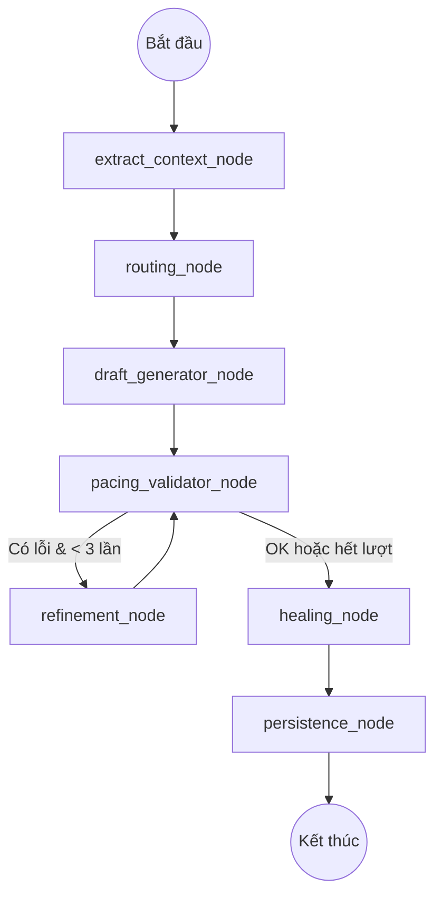

# Kế hoạch chuyển đổi AI Leader Agent sang kiến trúc LangGraph

Tài liệu này đặc tả kế hoạch nâng cấp AI Leader Agent từ việc sử dụng `SmolAgents` sang **LangGraph**, nhằm tăng cường tính ổn định, khả năng kiểm soát luồng xử lý phức tạp và hỗ trợ tự sửa lỗi (self-healing) tốt hơn.

## 1. Lý do chuyển đổi (Rationale)

*   **Loại bỏ thảm họa "JSON-in-JSON" (Vấn đề cốt lõi):** Các Framework Agent như `SmolAgents` thường ép LLM trả kết quả qua một tool (ví dụ: `final_answer(answer="...")`). Khi kết quả là một kịch bản JSON khổng lồ, LLM phải nhét JSON vào trong String, ép nó phải tự escape hàng ngàn ký tự (`\"`, `\n`). Các model <14B (như Qwen 8B) thường xuyên escape thiếu/sai ở giữa chừng làm hỏng toàn bộ cú pháp, gây sập hệ thống (Parse Error). Chuyển sang LangGraph cho phép ta gọi LLM trả về **Văn bản thô (Raw JSON Markdown)** và trích xuất bằng Regex, vứt bỏ hoàn toàn bước escape ngớ ngẩn này.
*   **Kiểm soát trạng thái (State Management):** LangGraph cho phép định nghĩa một "State" rõ ràng xuyên suốt quá trình từ khi nhận webhook đến khi tạo bản nháp (DRAFT).
*   **Vòng lặp tường minh (Explicit Cycles):** Việc kiểm tra nhịp độ (pacing validation) và yêu cầu LLM sửa lại kịch bản sẽ được thể hiện bằng các cạnh (edges) tường minh trong Graph thay vì ẩn bên trong logic của SmolAgents.
*   **Khả năng mở rộng:** Dễ dàng thêm các bước phân tích mới (ví dụ: phân tích hình ảnh, kiểm tra tính pháp lý của kịch bản) bằng cách thêm các nút (nodes).
*   **Tách biệt logic:** Phân tách rõ ràng giữa các bước gọi LLM và các bước xử lý Python thuần túy (Healing, DB Persistance).

---

## 2. Thiết kế Đồ thị (Graph Design)

### Giải pháp kỹ thuật: Khắc phục lỗi "Ngáo Escape Ký Tự"
Ở Node `draft_generator_node`, chúng ta **TUYỆT ĐỐI KHÔNG SỬ DỤNG TOOL CALLING**.
Chúng ta sẽ yêu cầu LLM sinh ra văn bản bình thường chứa một khối mã:
```json
{
  "worker_type": "review",
  ... kịch bản hàng ngàn chữ không cần escape \n hay \" ...
}
```
Sau đó sử dụng Python Regex (`worker_leader.utils.extract_json_from_text`) để bóc tách khối này ra và `json.loads()`. Phương pháp này an toàn 100% với các model nhỏ cục bộ.

### 2.1. Đối tượng Trạng thái (State Schema)
Sử dụng `TypedDict` để quản lý thông tin:
*   `raw_payload`: Dữ liệu gốc từ TMCP.
*   `context`: Dữ liệu đã được chuẩn hóa (brand, campaign, script).
*   `worker_type`: Loại worker được chọn (review, unbox_viral, slideshow, translify).
*   `ai_metadata`: Thông tin phân tích (hook_score, seo_titles, qa_warnings).
*   `draft_variants`: Object chứa các bản nháp (`original`, `viral_optimized`).
*   `pacing_errors`: Danh sách các cảnh bị lỗi nhịp độ chữ (> 4.5 từ/giây).
*   `pacing_attempts`: Số lần đã cố gắng yêu cầu LLM sửa nhịp độ (giới hạn tối đa 3 lần).

### 2.2. Các Nút xử lý (Nodes)
1.  **`extract_context_node`**: (Python) Trích xuất và chuẩn hóa dữ liệu từ `raw_payload`.
2.  **`routing_node`**: (LLM) Phân tích kịch bản để quyết định `worker_type`.
3.  **`draft_generator_node`**: (LLM) Sinh cấu hình chi tiết cho `original` và `viral_optimized`.
4.  **`pacing_validator_node`**: (Python) Sử dụng công cụ `validate_video_pacing` để tìm lỗi.
5.  **`refinement_node`**: (LLM) Gửi lại thông tin lỗi cho LLM để điều chỉnh độ dài kịch bản hoặc thời lượng phân cảnh.
6.  **`healing_node`**: (Python) Chạy các bộ Healers (`_heal_review`, `_heal_slideshow`,...) để đảm bảo JSON sạch và đầy đủ.
7.  **`persistence_node`**: (DB) Lưu kết quả cuối cùng vào PostgreSQL và tạo VideoJob ở trạng thái `DRAFT`.

### 2.3. Sơ đồ luồng (Workflow)


---

## 3. Giải Quyết Các Điểm Chết (Failure Modes)

Dựa trên kinh nghiệm triển khai Local LLM thực tế, LangGraph có 3 tử huyệt nếu không thiết kế kỹ. Dưới đây là cách chúng ta sẽ vượt qua chúng:

### 3.1. Chống Vòng Lặp Vô Tận (Infinite Loops Mitigation)
*   **Vấn đề:** Model nhỏ (9B) thường "cố chấp". Nếu đã sai nhịp độ, ép sửa thêm 2-3 lần thường làm nó "ngáo" và bịa ra kịch bản rác, dẫn đến vòng lặp vĩnh viễn giữa Node Python (báo lỗi) và Node LLM (sửa sai).
*   **Giải pháp:** 
    *   Thêm biến `pacing_attempts` vào `State`.
    *   Sử dụng **Conditional Edge** tại Node Validator: `if state["pacing_attempts"] >= 3: route_to("healing_node")`.
    *   Thay vì đập bỏ Job (FAILED), ta sẽ **chấp nhận bản lỗi** và đẩy nó sang `healing_node`. Tại đây, Python Healers sẽ dùng regex để cắt gọt hoặc tự động nới rộng thời lượng (duration) của phân cảnh để ép nhịp độ xuống mức an toàn.

### 3.2. Chống Phình To Trạng Thái (State Bloat & VRAM Exhaustion)
*   **Vấn đề:** Input ban đầu đã 10K tokens. Nếu mỗi vòng lặp ta lại "append" lời chửi của Python và kịch bản mới của LLM vào State, Context Window sẽ phình lên 30K-40K tokens. Card 4060 Ti sẽ tràn VRAM (OOM) hoặc chạy cực chậm.
*   **Giải pháp - State Overwrite:** Không dùng cơ chế `Annotated[list, operator.add]` (cộng dồn) cho các trường chứa Text lớn trong `LeaderAgentState`. Ta sẽ ghi đè (overwrite). LLM chỉ nhìn thấy Input gốc + **1 lời nhắc lỗi gần nhất** (của lần chạy trước), thay vì nhìn thấy toàn bộ lịch sử tranh luận dông dài.

### 3.3. Xung Đột Kết Nối Database (Celery vs LangGraph)
*   **Vấn đề:** Chạy LangGraph (đồng bộ/bất đồng bộ) bên trong một Celery Worker rất dễ dẫm chân lên `SessionLocal` của SQLAlchemy. Nếu dùng Checkpointer của LangGraph ghi vào Postgres, nó sẽ giành giật Connection Pool gây lỗi `Connection Pool Exhausted` hoặc làm "treo" (lock) DB lúc nửa đêm.
*   **Giải pháp - Tắt Checkpointer ngầm:** 
    *   Tuyệt đối **KHÔNG dùng Checkpointer** tích hợp sẵn của LangGraph (như PostgresSaver hay MemorySaver) cho Leader Agent.
    *   Luồng của Leader Agent diễn ra rất nhanh và phi trạng thái (Stateless) từ góc nhìn của Graph. Nếu server sập giữa chừng, Celery sẽ tự động retry cái Task đó từ đầu. Do đó, ta chạy Graph ở chế độ "trần" (chỉ chạy hết các node rồi trả về `State` cuối cùng).
    *   Việc mở/đóng DB Connection (`SessionLocal`) chỉ thực hiện duy nhất 1 lần ở Node cuối cùng: **`persistence_node`**, dùng ngữ cảnh `with SessionLocal() as db:` để giải phóng kết nối ngay tức khắc.

---

## 4. Tích hợp với Kiến trúc hiện tại

*   **LLM Configuration:** Sử dụng `resolve_llm_config` (đã triển khai) để lấy API Key, Base URL và Model Name dựa trên User và Feature Key.
*   **Shared Core:** Tiếp tục sử dụng các models SQLAlchemy và schemas Pydantic từ `shared_core`.
*   **Healers:** Tái sử dụng toàn bộ logic trong `worker_leader/healers/`.
*   **Celery:** `process_leader_job_impl` sẽ trở thành hàm khởi tạo và chạy Graph thông qua `app.invoke()`.

---

## 4. Kế hoạch Triển khai (Implementation Steps)

1.  **Bước 1: Cài đặt thư viện & Cấu hình:** 
    *   Bổ sung `langgraph` và `langchain-openai` vào `worker_leader/requirements.txt`.
    *   Đảm bảo `shared_core.llm_resolver` vẫn được sử dụng để lấy thông tin model cục bộ (Ollama) và API key (BYOK).

2.  **Bước 2: Định nghĩa State & Graph (`worker_leader/leader_graph.py`):**
    *   Tạo `LeaderAgentState` kế thừa `TypedDict`. Chứa các khóa: `raw_payload`, `context`, `worker_type`, `ai_metadata`, `draft_variants`, `pacing_errors`, `attempts`.

3.  **Bước 3: Xây dựng các Nodes cốt lõi:**
    *   **Node 1 (`extract_context_node`):** Port nguyên vẹn hàm `_extract_payload_context` từ `leader_runner.py`.
    *   **Node 2 (`routing_node`):** Dùng `langchain_openai.ChatOpenAI` (với base_url của Ollama). Gọi LLM với prompt chỉ yêu cầu trả về loại worker (e.g. `review`, `slideshow`). Có thể dùng `with_structured_output` (hoặc JSON mode) vì payload ở bước này rất nhỏ và không có kịch bản.
    *   **Node 3 (`draft_generator_node`):** **ĐÂY LÀ BƯỚC QUAN TRỌNG NHẤT KHẮC PHỤC LỖI "NGÁO ESCAPE".**
        *   Prompt: Yêu cầu LLM sinh ra kịch bản chi tiết dựa trên `worker_type`. Bắt buộc LLM phải đặt kết quả trong khối mã ` ```json ... ``` `.
        *   Thực thi: Dùng `ChatOpenAI.invoke` để lấy chuỗi văn bản (String).
        *   Hậu xử lý: Gọi hàm `worker_leader.utils.extract_json_from_text(result.content)` để bóc tách cái "Hộp JSON" đó ra thành Dictionary an toàn.
    *   **Node 4 (`pacing_validator_node`):** Nhận Dictionary từ bước 3. Quét mảng `timeline_script` hoặc `text_events`. Sử dụng hàm `validate_video_pacing` hiện có để check. Nếu có lỗi, ghi vào state `pacing_errors`.
    *   **Node 5 (`healing_node`):** Port nguyên hàm `_parse_and_heal_result`. Nạp `draft_variants.original` và `viral_optimized` vào `HEALERS_REGISTRY.get(worker_type)`. Đảm bảo các hàm Healers (`heal_review`, `heal_slideshow`) vẫn nhận đủ `script_content` và `title`.
    *   **Node 6 (`persistence_node`):** Port nguyên hàm `_create_draft_job` và cập nhật `JobLog`.

4.  **Bước 4: Cập nhật Runner (`worker_leader/leader_runner.py`):** 
    *   Hàm `process_leader_job_impl` sẽ khởi tạo đồ thị (Graph) từ `leader_graph.py` và gọi `graph.invoke({"raw_payload": payload})`.

5.  **Bước 5: Kiểm thử:** 
    *   Chạy script `/scratch/test_e2e_tmcp_agent.py` để đảm bảo luồng mới tạo ra bản ghi DRAFT chính xác, xử lý đúng lỗi Pacing, và không bao giờ bị dính lỗi Parse JSON.

---

## 5. Tiêu chuẩn đánh giá (Success Criteria)

*   **Tính toàn vẹn:** Bản nháp JSON đầu ra phải tuân thủ đúng spec yêu cầu bởi các Worker phía sau.
*   **Độ bền bỉ:** Hệ thống phải tự sửa lỗi nhịp độ chữ ít nhất 2 vòng lặp trước khi bỏ cuộc.
*   **Bảo mật:** API Keys không được log ra console hay lưu vào DB dưới dạng plain-text (sử dụng Masking đã làm).
*   **Minh bạch:** Mỗi bước chuyển nút trong Graph phải được log vào `JobLog` để Admin dễ dàng theo dõi Agent đang làm gì.
