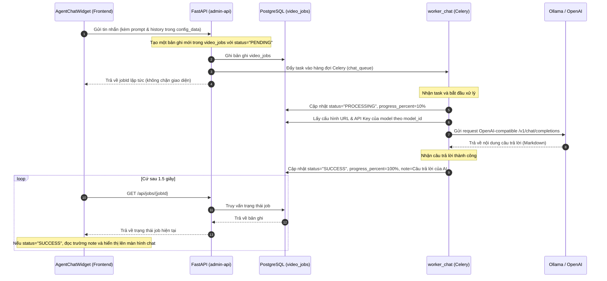

# Hướng dẫn Lưu trữ Dữ liệu Chat AI (AI Chat Storage & Data Structure)

Tài liệu này mô tả chi tiết vị trí lưu trữ, bảng cơ sở dữ liệu và cấu trúc dữ liệu của tính năng **Trợ lý AI Chat (AI Chat Assistant)** hoạt động thông qua `worker_chat` trong hệ thống VidGenius.

---

## 1. Bản/Bảng Cơ Sở Dữ Liệu Lưu Trữ (Database Table)

Tất cả các phiên chat, câu hỏi của người dùng và câu trả lời của mô hình ngôn ngữ lớn (LLM) đều được lưu trữ trực tiếp trong cơ sở dữ liệu PostgreSQL ở hai bảng chính:

1. **Bảng chính `video_jobs`** (Ánh xạ đến Model `VideoJob` trong file [shared_core/models.py](file:///\\wsl.localhost\server\root\marketing-video-agent\shared_core\models.py)):
   * Đây là bảng quản lý trạng thái các tác vụ nền trong hệ thống (như review, unbox, tts...).
   * Khi người dùng gửi tin nhắn chat, một công việc với loại `job_type = "chat"` sẽ được khởi tạo trong bảng này.
   * **Nội dung câu trả lời của AI** sau khi xử lý thành công sẽ được ghi đè trực tiếp vào cột **`note`** (Kiểu dữ liệu `TEXT`) dưới dạng định dạng **Markdown**.

2. **Bảng phụ `job_logs`** (Ánh xạ đến Model `JobLog`):
   * Lưu trữ lịch sử vết các bước xử lý của Worker (ví dụ: *"Đang gọi Ollama chat..."*, *"AI Assistant phản hồi thành công"*).
   * Liên kết trực tiếp với bảng `video_jobs` qua khóa ngoại `job_id`.

---

## 2. Chi Tiết Cấu Trúc Dữ Liệu (Data Schema)

Dưới đây là sơ đồ cấu trúc của một bản ghi tác vụ chat trong bảng `video_jobs`:

| Tên Cột (Column) | Kiểu Dữ Liệu (Type) | Mô Tả |
| :--- | :--- | :--- |
| `id` | `Integer` (PK) | Định danh duy nhất tự tăng của tác vụ chat. |
| `project_id` | `String` (FK) | ID của Project đang làm việc (Cần thiết để liên kết tác vụ nền). |
| `job_type` | `String` | Luôn luôn là `"chat"` đối với tác vụ chat AI. |
| `status` | `String` | Trạng thái xử lý: `"PENDING"`, `"PROCESSING"`, `"SUCCESS"`, hoặc `"FAILED"`. |
| `config_data` | `JSONB` | Chứa toàn bộ **Ngữ cảnh & Lịch sử chat** gửi từ giao diện UI lên (Chi tiết xem ở mục 3). |
| `note` | `Text` | **Nơi lưu trữ câu trả lời hoàn chỉnh của AI (LLM)** sau khi xử lý thành công. |
| `progress_percent`| `Integer` | Tiến trình xử lý (Ví dụ: `10%` khi bắt đầu, `50%` khi gọi LLM, `100%` khi hoàn thành). |
| `error_message` | `Text` | Lưu thông báo lỗi chi tiết nếu trạng thái tác vụ là `"FAILED"`. |
| `created_at` | `DateTime` | Thời gian người dùng nhấn gửi tin nhắn. |
| `completed_at` | `DateTime` | Thời gian Worker hoàn thành tác vụ và trả về kết quả. |

---

## 3. Cấu trúc trường `config_data` (Input & Chat History)

Trường `config_data` trong cơ sở dữ liệu lưu giữ trạng thái lịch sử chat (tối đa 10 tin nhắn gần nhất) để cung cấp bộ nhớ đệm (contextual memory) cho mô hình LLM khi xử lý tin nhắn tiếp theo.

### Định dạng lưu trữ thực tế trong cột `config_data`:
```json
{
  "model": "ollama-qwen2-5-3b", 
  "text": "Hãy gợi ý cho tôi 3 tiêu đề video marketing ngắn gọn",
  "history": [
    {
      "sender": "user",
      "text": "Chào bạn! Tôi muốn làm video quảng cáo son môi.",
      "timestamp": "2026-05-24T14:30:00.000Z"
    },
    {
      "sender": "ai",
      "text": "Chào bạn! Tôi có thể giúp gì cho bạn? Hãy chọn model và đưa ra yêu cầu.",
      "timestamp": "2026-05-24T14:30:10.000Z"
    }
  ]
}
```
* **`model`**: ID cấu hình LLM được lưu trong `system_settings` (key `"llm_models"`). Worker dùng ID này để truy vấn ngược lại Database lấy thông tin kết nối (Base URL, API Key, Model Tag).
* **`text`**: Câu hỏi hiện tại (Prompt) của người dùng.
* **`history`**: Mảng lưu trữ hội thoại trước đó để gửi kèm làm ngữ cảnh bộ nhớ cho LLM.

---

## 4. Luồng xử lý và đồng bộ dữ liệu (Data Flow)



### Ưu điểm của cấu trúc này:
1. **Lưu vết đầy đủ:** Mọi cuộc trò chuyện đều được lưu lại lịch sử trong cơ sở dữ liệu làm bằng chứng kiểm toán (Audit Trail) để sau này phân tích hành vi hoặc tính toán chi phí token.
2. **Không chặn giao diện (Non-blocking UI):** Khách hàng có thể đóng khung chat, chuyển trang và quay lại sau mà không bị mất tin nhắn, giao diện liên tục cập nhật tiến độ từ DB thông qua cơ chế polling.
3. **Quản lý tập trung:** Sử dụng chung mô hình hàng đợi tác vụ nền Celery cùng với các Worker sinh video, giúp hệ thống đồng bộ và dễ mở rộng.
