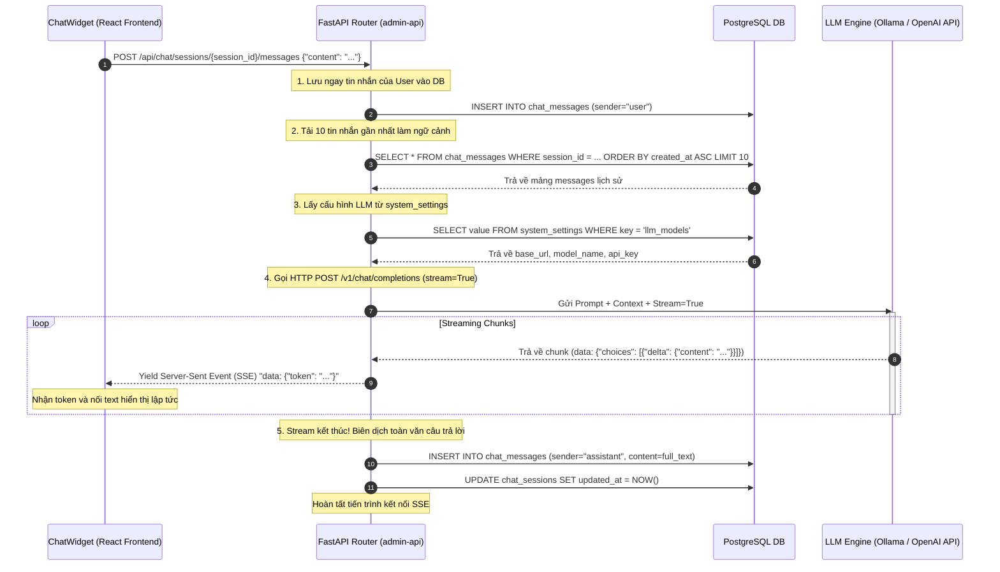

# Hướng Dẫn Kỹ Thuật: Trợ Lý AI Chat & Kiến Trúc Lưu Trữ (Real-time SSE Chat)

Tài liệu này mô tả chi tiết kiến trúc kỹ thuật, luồng truyền nhận dữ liệu thời gian thực và cấu trúc lưu trữ cơ sở dữ liệu của tính năng **Trợ Lý AI Chat (AI Chat Assistant)** tích hợp trong VidGenius.

---

## 🏗️ 1. Góc Nhìn Kiến Trúc: Luồng Stream Trực Tiếp SSE

Hệ thống đã nâng cấp toàn diện phân hệ Chat:
- **Loại bỏ hàng đợi Celery chậm**: Thay vì tạo Job PENDING trong `video_jobs` và đợi hàng đợi Celery của `worker_chat` kéo tin nhắn (mất 5-10 giây để nhận phản hồi đầu tiên), hệ thống sử dụng kết nối trực tiếp **Server-Sent Events (SSE)** qua giao thức HTTP truyền trực tiếp từng token (Stream) từ mô hình ngôn ngữ (Ollama/OpenAI) về giao diện người dùng.
- **Trải nghiệm thời gian thực (Zero Latency)**: Giao diện hiển thị chữ chạy từng từ giống ChatGPT ngay khi mô hình vừa tính toán xong, đem lại trải nghiệm mượt mà vượt trội.
- **Tự động lưu trữ bền vững**: Cả tin nhắn của User gửi lên và câu trả lời hoàn thiện từ AI đều được tự động ghi nhận vào cơ sở dữ liệu PostgreSQL ở cuối tiến trình.

---

## 🗄️ 2. Cấu Trúc Cơ Sở Dữ Liệu (PostgreSQL Schema)

Hội thoại chat được phân tách riêng biệt khỏi bảng tác vụ video (`video_jobs`), lưu trữ trong hai bảng chuyên biệt liên kết với nhau:

### A. Bảng Phiên Hội Thoại (`chat_sessions`)
Lưu thông tin các cuộc hội thoại khác nhau của người dùng trong từng dự án:

| Tên Cột (Column) | Kiểu Dữ Liệu (Type) | Ràng Buộc | Mô Tả |
| :--- | :--- | :--- | :--- |
| `id` | `String` | PK (UUID) | Mã định danh duy nhất của phiên hội thoại. |
| `project_id` | `String` | FK | Liên kết tới dự án chủ quản (`projects.id`). |
| `user_id` | `Integer` | FK | Người sở hữu cuộc trò chuyện (`users.id`). |
| `title` | `String` | Not Null | Tiêu đề cuộc hội thoại (do AI tự sinh hoặc user đặt). |
| `selected_model_id`| `String` | Nullable | ID cấu hình LLM đang sử dụng (ví dụ: `qwen-2.5`). |
| `created_at` | `DateTime` | Not Null | Thời gian khởi tạo phiên trò chuyện. |
| `updated_at` | `DateTime` | Not Null | Thời gian cập nhật tin nhắn cuối cùng. |

### B. Bảng Chi Tiết Tin Nhắn (`chat_messages`)
Lưu trữ lịch sử chat chi tiết từng câu hỏi/đáp:

| Tên Cột (Column) | Kiểu Dữ Liệu (Type) | Ràng Buộc | Mô Tả |
| :--- | :--- | :--- | :--- |
| `id` | `Integer` | PK (AutoInc) | Định danh duy nhất tự tăng của tin nhắn. |
| `session_id` | `String` | FK | Thuộc về phiên hội thoại nào (`chat_sessions.id` - `ON DELETE CASCADE`). |
| `sender` | `String` | Not Null | Vai trò người gửi: `"user"` (người dùng) hoặc `"assistant"` (AI). |
| `content` | `Text` | Not Null | Nội dung chi tiết tin nhắn (định dạng Markdown đối với assistant). |
| `created_at` | `DateTime` | Not Null | Thời gian gửi/nhận tin nhắn. |

---

## 🔄 3. Luồng Truyền Dữ Liệu Thời Gian Thực (Sequence Diagram)

Sơ đồ dưới đây biểu diễn quá trình từ khi người dùng nhập câu hỏi trên giao diện Admin UI đến khi nhận luồng token truyền ngược lại và lưu DB tự động:



---

## ⚡ 4. Chi Tiết Kỹ Thuật Router `chat.py`

Khi người dùng gửi tin nhắn, FastAPI thực thi Generator Function `sse_generator()` bất đồng bộ:

1. **Khởi tạo và Validate**:
   Kiểm tra sự tồn tại của `session_id`, làm sạch chuỗi câu hỏi đầu vào, lưu bản ghi `user` vào DB ngay lập tức để tránh mất mát dữ liệu nếu kết nối bị đứt.
2. **Nạp Ngữ Cảnh**:
   Lấy 10 tin nhắn gần nhất trong bảng `chat_messages` sắp xếp tăng dần theo thời gian, định dạng lại thành cấu trúc `{"role": "user" | "assistant", "content": "..."}` để nạp làm `messages` payload cho LLM.
3. **Phân Giải Mô Hình**:
   Hàm `_resolve_llm_config` truy vấn cấu hình kết nối từ khoá `llm_models` của hệ thống. Nếu không tìm thấy cấu hình custom, hệ thống tự động fallback về cấu hình mặc định (ví dụ: Ollama chạy cục bộ `http://localhost:11434` với model `qwen3.5:latest`).
4. **Stream Delivery**:
   Thiết lập luồng gọi `httpx` hoặc `requests.post` có thuộc tính `stream=True`. Đọc liên tục các dòng trả về từ LLM, trích xuất chuỗi JSON `delta` và trả về Client dưới header `text/event-stream`.
5. **Cơ Chế Thread-Safe Ghi Nhận**:
   Vì kết nối client có thể bị ngắt giữa chừng, FastAPI sử dụng một Session DB độc lập (`SessionLocal`) ở cuối hàm generator để ghi nhận nội dung câu trả lời hoàn thiện từ AI vào PostgreSQL một cách an toàn.

---

## ⚠️ 5. Lưu Ý Về Tiến Trình `worker_chat` (Legacy)

Trong file chạy `dev.sh`, bạn vẫn sẽ thấy tiến trình khởi chạy Celery queue `chat_queue` của `worker_chat`:

```bash
cd "$ROOT_DIR/worker_chat"
"$CHAT_VENV/bin/celery" -A celery_worker worker -P solo -Q chat_queue ...
```

- **Mục đích**: Đây là tiến trình **Legacy (Tương thích ngược)** phục vụ các webhook cũ hoặc các tác vụ background job phân tích kịch bản hàng loạt không yêu cầu streaming thời gian thực.
- **Khuyến nghị**: Khi phát triển tính năng chat mới cho người dùng trên Web UI, **luôn sử dụng router `/api/chat` trực tiếp** để tận dụng tối đa cơ chế Stream SSE tiết kiệm tài nguyên và nâng cao trải nghiệm người dùng.
