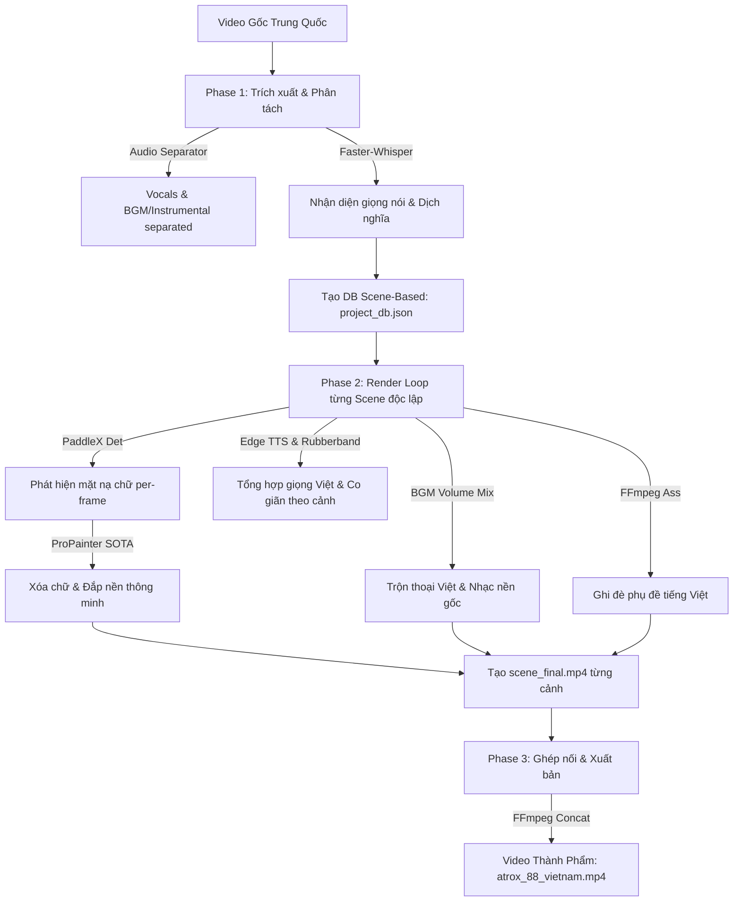

# Hướng Dẫn Kỹ Thuật: Worker Translify (Video Translation & SOTA Inpainting)

Hệ thống **Worker Translify** (`translify` job type) là một AI-powered engine chuyên biệt thiết kế để dịch thuật, Việt hóa các video ngắn quảng cáo/marketing nước ngoài (đặc biệt là video Douyin, Kuaishou định dạng dọc 9:16). 

Engine này kết hợp các mô hình học sâu SOTA về nhận diện chữ (PaddleX), xóa chữ video thông minh (ProPainter), phân tách âm thanh (UVR MDX-Net), nhận dạng giọng nói (Faster-Whisper), và tổng hợp giọng đọc thuyết minh (Edge TTS) để tạo ra video thành phẩm Việt hóa tiệp màu nền hoàn hảo, không vết mờ nhòe.

---

## 1. Sơ Đồ Quy Trình Tổng Quan (Pipeline Architecture)

Mô hình hoạt động của Translify được chia làm 5 Phase chính chạy tuần tự:



---

## 2. Các Công Nghệ Cốt Lõi Tích Hợp (Core Technologies)

| Tên Module | Công Nghệ / Thư Viện sử dụng | Vai trò kỹ thuật |
| :--- | :--- | :--- |
| **Vocal Separation** | `audio-separator` (UVR MDX-Net) | Phân tách giọng thuyết minh gốc và nhạc nền (BGM) riêng biệt. |
| **Speech-To-Text** | `faster-whisper` (large-v3, GPU) | Chuyển giọng nói sang văn bản kèm chính xác timestamp. |
| **Text Detection** | `paddlex` (`PP-OCRv4_mobile_det`) | Nhận dạng tọa độ vùng chữ Trung Quốc trên từng frame hình. |
| **Video Inpainting** | **ProPainter (SOTA)** | Lấp đầy vùng chữ bị xóa bằng điểm ảnh tự nhiên trích xuất từ quá khứ/tương lai của clip. |
| **Voice stretching** | `pyrubberband` & `rubberband-cli` | Co giãn tần số/cao độ âm thoại thuyết minh Việt cho vừa khít với thời lượng scene. |
| **Subtitle Burn** | FFmpeg `libass` filter | Đốt cứng phụ đề tiếng Việt chuyển động (Karaoke/Micro-subs) vào video. |

---

## 3. Module Xóa Chữ Thông Minh (Smart Video Inpainting & OCR)

Xóa chữ không tì vết là phần quan trọng nhất của hệ thống. Thay vì bôi mờ (blur) hoặc chắp vá thô sơ (`cv2.inpaint`), Translify áp dụng chuỗi xử lý học sâu GPU cao cấp:

### A. Tối Ưu Hóa Tránh Treo Mạng PaddleX
- **Vấn đề thường gặp:** Thư viện `PaddleOCR` tiêu chuẩn cố gắng kiểm tra mạng và tự động tải mô hình Nhận diện chữ (`PP-OCRv4_mobile_rec`) từ máy chủ Trung Quốc, gây ra hiện tượng nghẽn mạng và treo ứng dụng (startup delay) lên tới vài phút.
- **Giải pháp tối ưu:** Sử dụng mô hình tách biệt chỉ chứa lớp Phát hiện biên chữ (`detector-only`) thông qua hàm lazily cached:
  ```python
  import paddlex as px
  model = px.create_model("PP-OCRv4_mobile_det")
  ```
  Cách này bỏ qua hoàn toàn luồng tải nhận diện giọng đọc/nhận dạng chữ Trung Quốc không cần thiết, giúp mô hình khởi tạo siêu tốc chỉ trong **3 giây**.

### B. Thuật Toán Tạo Mặt Nạ Khớp Khít 100%
Để đối phó với hiện tượng rung lắc camera (camera drift), trượt chữ, chữ mờ chuyển động:
1. **Per-frame OCR Detection:** Chạy phát hiện tọa độ chữ trực tiếp trên mảng numpy frame trong bộ nhớ GPU bằng lệnh `model.predict(frame, box_thresh=0.5, thresh=0.3, unclip_ratio=1.5)`. Tránh hoàn toàn việc ghi/đọc file đĩa trung gian giúp tối ưu hóa hiệu suất tối đa.
2. **Temporal Mask Smoothing (Union ±1 frame):** Gộp mặt nạ (Logical OR) của frame $i$ với hai frame liền kề ($i-1$ và $i+1$). Phương pháp này triệt tiêu hoàn toàn hiện tượng nhấp nháy mask (flickering) khi chữ xuất hiện đột ngột hoặc biến mất nhanh.
3. **Generous Dilation:** Co giãn giãn nở mặt nạ bằng kernel kích thước lớn $11 \times 11$ với `iterations=2` để che phủ hoàn chỉnh toàn bộ bóng mờ biên chữ (antialiased edges) và drop shadows.

### C. ProPainter Video Inpainting & VRAM Safety
ProPainter tái cấu trúc các pixel bị che phủ bằng cách sử dụng cơ chế Attention để tìm các vùng ảnh tương thích ở các khung hình trước và sau đó.
- **VRAM Optimization:** Đối với GPU 12GB - 16GB (như RTX 3060, RTX 4060 Ti), việc đẩy toàn bộ video dài vào bộ nhớ GPU sẽ gây crash CUDA Out-Of-Memory (OOM). Translify giải quyết bằng cách chia video thành các block nhỏ thích ứng:
  - `chunk_size = 60` (Kích thước block xử lý song song).
  - `overlap = 8` (Độ gối đầu giữa các block giúp blend mượt mà không bị sọc viền).
- **GPU Memory Cleanup:** Sau mỗi scene hoàn tất, hệ thống thực hiện giải phóng bộ đệm rác GPU quyết liệt:
  ```python
  gc.collect()
  torch.cuda.empty_cache()
  torch.cuda.ipc_collect()
  ```

### D. Monkeypatch Lỗi Chỉ Mục Của PyTorchCV
Khi chia nhỏ video thành các block rất ngắn (nhỏ hơn 30 frames), mô hình ProPainter (`BufferedSequencer`) cố gắng dọn dẹp bộ đệm bằng hàm `trim_buffer_to` dẫn tới chỉ mục âm và báo lỗi `AssertionError: assert (index.start >= 0)`.
Translify áp dụng kỹ thuật **Monkeypatch** ngay khi import module để vô hiệu hóa việc trim bộ đệm dư thừa này:
```python
try:
    from pytorchcv.models.common.stream import BufferedSequencer
    BufferedSequencer.trim_buffer_to = lambda self, start: None
    logger.info("Monkeypatched BufferedSequencer.trim_buffer_to to prevent index trimming errors.")
except Exception as patch_err:
    logger.warning(f"Failed to patch BufferedSequencer: {patch_err}")
```

---

## 4. Cơ Chế Khôi Phục Thông Minh (Work Recovery System)

Quá trình chạy inpainting deep learning rất tốn thời gian. Nếu hệ thống gặp sự cố mất điện, khởi động lại máy, hoặc crash giữa chừng, việc render lại từ đầu là cực kỳ lãng phí (mất từ 1 đến 2 tiếng).
Translify trang bị tính năng **Work Recovery** tự động kiểm tra trạng thái trước khi render từng scene:

- Hệ thống kiểm tra xem file `scene_final.mp4` đã tồn tại trong thư mục scene tương ứng hay chưa.
- Kiểm tra timestamp chỉnh sửa cuối cùng của file đó. Nếu file được ghi nhận tạo ra sau mốc thời gian an toàn (Cutoff time, ví dụ sau khi bắt đầu phiên chạy chất lượng cao hôm nay), hệ thống sẽ **bỏ qua ngay lập tức** scene đó và chuyển sang scene tiếp theo.
- Tiết kiệm lên tới hơn 90% thời gian chạy lại nếu chỉ bị lỗi ở những giây cuối của video.

---

## 5. Đồng Bộ Âm Thanh Bằng Rubberband (Audio Co-stretching)

Giọng đọc thuyết minh tiếng Việt được tạo ra từ TTS thường có độ dài phát âm ngắn hoặc dài hơn thời lượng thực tế của scene gốc (vốn được căn thời gian theo tiếng Trung).
Để tiếng Việt khớp khẩu hình và mạch lạc:
1. Hệ thống tính toán tỉ lệ thời lượng phát âm thực tế so với độ dài của cảnh: `ratio = actual_dur / scene_dur`.
2. Áp dụng giới hạn tỷ lệ an toàn (`0.5` đến `2.0` lần) để tránh tiếng bị méo quá mức.
3. Nếu tỉ lệ sai lệch vượt quá 5%, hệ thống sử dụng thuật toán chất lượng cao **Rubberband** để co giãn/nén âm thanh mà không làm thay đổi tông/pitch của giọng nói:
   ```python
   import pyrubberband as pyrb
   data_stretched = pyrb.time_stretch(data, sr, ratio)
   ```
4. Tiếp tục cắt ngắn (crop) hoặc chèn thêm khoảng lặng (silent padding) để khớp chuẩn xác từng mili-giây với scene.

---

## 6. Hướng Dẫn Vận Hành & Tinh Chỉnh (Developer & AI Agent Guide)

### Các Lệnh Chạy Thực Tế (WSL2 / Linux GPU)
Để khởi chạy render lại thủ công hoặc chạy kiểm thử trực tiếp trên GPU:

```bash
# Kích hoạt môi trường ảo
source .venv-api/bin/activate

# Chạy script render độc lập (Render Only) sử dụng project database có sẵn
python3 worker_translify/run_render_only.py
```

### Các Lỗi Thường Gặp & Cách Khắc Phục (Troubleshooting)

1. **Lỗi không tìm thấy thư viện Rubberband:**
   - *Triệu chứng:* `pyrubberband.py` báo lỗi không tìm thấy CLI `rubberband`.
   - *Khắc phục:* Cài đặt gói thư viện hệ thống trong WSL:
     ```bash
     sudo apt-get update && sudo apt-get install -y rubberband-cli
     ```

2. **Lỗi CUDA Out of Memory (OOM):**
   - *Triệu chứng:* Crash PyTorch khi đang chạy inpaint ProPainter.
   - *Khắc phục:* Mở file `worker_translify/translify_engine/render_engine.py` và giảm `chunk_size` xuống `40` hoặc `30` (giảm tải xử lý song song trong bộ nhớ GPU).

3. **Lỗi lệch tọa độ phụ đề (Subtitles Alignment):**
   - *Triệu chứng:* Phụ đề tiếng Việt bị lệch lề hoặc tràn viền màn hình dọc.
   - *Khắc phục:* Điều chỉnh file cấu hình kiểu ASS trong `worker_translify/translify_engine/subtitle_utils.py` để định vị kích thước khung hình dọc `PlayResX: 720`, `PlayResY: 1280`.

---

> [!TIP]
> **Lời khuyên cho AI Agent tiếp theo:** 
> Khi được yêu cầu tối ưu chất lượng xóa chữ, hãy luôn giữ cơ chế **Per-frame Detection** và **ProPainter** ở độ phân giải gốc (`image_resize_ratio=1.0`). GPU RTX 4060 Ti 16GB dư sức gánh mức tải này mà không bị nghẽn nếu bật đúng `chunk_size = 60` kết hợp cơ chế giải phóng bộ nhớ `clean_gpu_memory()`. Hãy tôn trọng tệp `project_db.json` trong thư mục tạm `translify_tmp` vì nó lưu trữ tất cả metadata dịch thuật quan trọng của cả bộ video!
