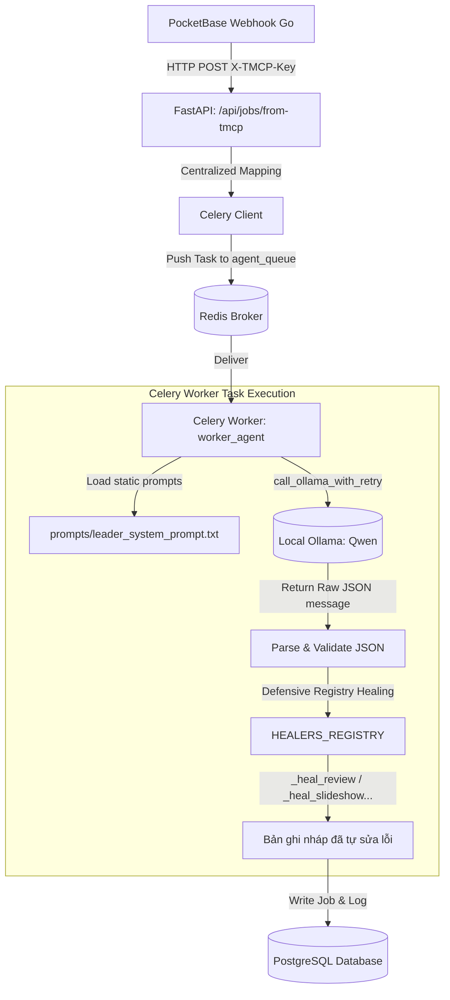

# Tài Liệu Kiến Trúc Tích Hợp Webhook & AI Leader Agent
## Phân Hệ Video-Agent (FastAPI, Celery Workers & Ollama)

Tài liệu này mô tả chi tiết kiến trúc kỹ thuật và đặc tả nghiệp vụ của hệ thống **Leader Agent Orchestrator** cùng cổng tiếp nhận Webhook đồng bộ từ phân hệ TMCP.

---

## 🎯 I. GÓC NHÌN NGHIỆP VỤ (BUSINESS PERSPECTIVE)

### 1. Vai Trò Của AI Leader Agent
Trong hệ thống sản xuất video tự động, **AI Leader Agent** đóng vai trò là một "Tổng đạo diễn" thông minh kỹ thuật số:
* **Định vị phân cảnh**: Đọc hiểu sâu sắc kịch bản thô, trích xuất mục tiêu chiến dịch, định vị đối tượng khách hàng mục tiêu và nhận diện tông giọng thương hiệu.
* **Quyết định phong cách (Routing)**: Tự động phân loại và quyết định xem kịch bản này nên chuyển sang "xưởng sản xuất" (Worker Agent) nào là tối ưu nhất:
  * `review`: Dành cho các kịch bản phân tích sâu tính năng kỹ thuật, so sánh sản phẩm, biểu diễn timeline phân cảnh chặt chẽ.
  * `slideshow`: Dành cho kịch bản giới thiệu chuỗi sản phẩm tĩnh, làm nổi bật hình ảnh và các đặc điểm bán hàng (USP).
  * `unbox_viral`: Dành cho kịch bản đập hộp sản phẩm năng động, tạo trend nhanh, sử dụng chuỗi sự kiện văn bản ngắn.
  * `translify`: Dành cho kịch bản dịch thuật hoặc lồng tiếng tự động từ video nguồn.
* **Tự động điền nháp cấu hình (Draft Generation & Self-Healing)**: Tự động chuẩn bị sẵn các asset (nhạc nền BGM, hình ảnh minh họa phù hợp) và điền sẵn bảng kịch bản phân đoạn chi tiết. Giúp người dùng tiết kiệm đến **95% thời gian chuẩn bị**.

### 2. Hệ Thống Tự Phục Hồi Dữ Liệu (Defensive Self-Healing)
Một trong những thách thức lớn nhất khi tích hợp LLM (như Qwen/Ollama) vào hệ thống thực tế là LLM có thể sinh ra JSON bị thiếu trường hoặc sai cấu hình phân cảnh.
* Hệ thống tích hợp **bộ tự phục hồi phòng thủ (Self-Healing)** ngầm.
* Nếu LLM bị thiếu trường dữ liệu, hoặc đặt sai tên khóa (ví dụ: sinh `review_points` thay vì `timeline_script`), hệ thống sẽ **tự động phát hiện, sửa lỗi cấu trúc, trích xuất nội dung từ kịch bản thô để tự điền bù**.
* Đảm bảo giao diện người dùng (React Admin) **không bao giờ bị trống dữ liệu** và luôn hiển thị biểu mẫu nháp hoàn chỉnh nhất có thể.

---

## 🏗️ II. KIẾN TRÚC KỸ THUẬT (ARCHITECTURAL & TECHNICAL PERSPECTIVE)

### 1. Sơ Đồ Thiết Kế Hệ Thống (System Design Diagram)



---

### 2. Các Mẫu Thiết Kế Cốt Lõi (Key Design Patterns Refactored)

#### A. Cô Lập Prompts Tĩnh (Prompt Isolation Pattern)
* **Thiết kế cũ**: Toàn bộ hệ thống prompt của Leader Agent và các CodeAgent đều được hardcode dạng chuỗi viết trực tiếp trong file mã nguồn Python `agent_runner.py`.
* **Thiết kế mới**: Các prompts tĩnh được đưa ra ngoài hoàn toàn dưới dạng các file văn bản thuần túy trong thư mục `worker_agent/prompts/`:
  1. `prompts/agent_instructions.txt`: Hướng dẫn vận hành của Agent chế độ Full.
  2. `prompts/agent_instructions_research.txt`: Hướng dẫn vận hành của Agent chế độ Research.
  3. `prompts/leader_system_prompt.txt`: Hướng dẫn tư duy, định dạng đầu ra cho AI Leader Agent.
* **Cơ chế nạp**: Sử dụng helper an toàn `load_prompt(filename)` nạp tài nguyên động tại thời điểm khởi chạy dịch vụ, cô lập hoàn toàn logic phần mềm khỏi dữ liệu prompt tự nhiên.

#### B. Cơ Chế Bền Bỉ Lỗi Mạng (Ollama Exponential Backoff Retry)
API Ollama chạy cục bộ có thể gặp các lỗi kết nối tạm thời do quá tải hàng đợi (queue congestion) hoặc lag khi cold-start tải mô hình lớn (model loading delay).
* Hàm `call_ollama_with_retry` bảo bọc toàn bộ các yêu cầu HTTP POST sang Ollama.
* Tích hợp thuật toán **Exponential Backoff**: Nếu gặp lỗi mạng hoặc HTTP Status 5xx, hệ thống sẽ tự động thử lại tối đa **3 lần** với thời gian nghỉ tăng dần:
  $$\text{Wait Time} = \text{backoff} \times 2^{\text{attempt}}$$
  *(Lần 1: nghỉ 2 giây, Lần 2: nghỉ 4 giây, Lần 3: nghỉ 8 giây)*.
* Ngăn chặn tuyệt đối tình trạng sập luồng xử lý hoặc chuyển trạng thái Job sang `FAILED` oan do sự cố mạng tức thời.

#### C. Mô-đun Hóa Bộ Tự Phục Hồi (Defensive Healer Registry)
* **Thiết kế cũ**: Hàm `heal_draft_parameters` dài hơn 180 dòng, ôm đồm xử lý phòng thủ cho cả 4 worker khiến mã nguồn cực kỳ phức tạp và không thể viết Unit Test riêng lẻ.
* **Thiết kế mới**: Tách nhỏ thành các healer độc lập tuân thủ nguyên tắc Single Responsibility Principle (SRP):
  * `_heal_review`: Chuẩn hóa mảng `timeline_script`, tự phục hồi khi LLM trả về định dạng `review_points` hoặc tự tách kịch bản thô thành các segment thời lượng cân đối.
  * `_heal_slideshow`: Chuẩn hóa đối tượng `input_json.products`, bổ sung hình ảnh dự phòng từ Unsplash và tự sinh text mô tả nếu thiếu.
  * `_heal_unbox_viral`: Chuẩn hóa mảng sự kiện văn bản `text_events` và gán thời gian hiển thị tương ứng.
  * `_heal_translify`: Đảm bảo cấu hình giọng đọc chuẩn tiếng Việt và video stub.
* Các healer được đăng ký tập trung vào `HEALERS_REGISTRY` dict để router chính gọi động:
```python
HEALERS_REGISTRY = {
    "review": _heal_review,
    "slideshow": _heal_slideshow,
    "unbox_viral": _heal_unbox_viral,
    "translify": _heal_translify
}
```

#### D. Loại Bỏ Lặp Code Celery Mapping (DRY Jobs Router)
* **Thiết kế cũ**: Logic chuyển đổi `job_type` thành tên hàng đợi (`queue_name`) và tên Celery task (`task_name`) bị lặp lại ở nhiều API endpoint trong `admin-api/routers/jobs.py`.
* **Thiết kế mới**: Tập trung toàn bộ logic ánh xạ này vào một hàm helper duy nhất:
  `resolve_celery_task_and_queue(job_type: str) -> tuple[str, str]`
* Khi cần tích hợp thêm một Worker Agent mới trong tương lai, lập trình viên chỉ cần khai báo thêm một dòng trong helper này thay vì phải tìm sửa ở nhiều file/endpoint khác nhau.
* Đồng thời xây dựng helper `get_or_create_tmcp_project` tách biệt tầng Service Layer đảm nhiệm việc truy vấn, khởi tạo lazy dự án liên kết TMCP Outsource.

---

### 3. Hướng Dẫn Vận Hành Cho Lập Trình Viên (Developer Ops)

#### A. Kiểm tra biên dịch mã nguồn (Build & Syntax Check)
1. **Kiểm tra FastAPI**:
   ```bash
   cd /root/marketing-video-agent/admin-api
   source .venv-api/bin/activate
   python -m py_compile main.py
   ```
2. **Kiểm tra Celery Worker**:
   ```bash
   cd /root/marketing-video-agent/worker_agent
   source venv/bin/activate
   python -m py_compile celery_worker.py
   ```

#### B. Chạy kiểm thử tích hợp E2E tự động
Để xác nhận tính toàn vẹn của luồng Leader Agent sau khi thay đổi prompt hoặc sửa logic:
```bash
python3 /root/marketing-video-agent/scratch/test_e2e_tmcp_agent.py
```
*Script sẽ giả lập webhook từ TMCP gửi sang, kiểm tra tiến trình phân tích ngầm của Celery Worker và đối chiếu tính toàn vẹn của bản ghi DRAFT được ghi vào cơ sở dữ liệu.*
