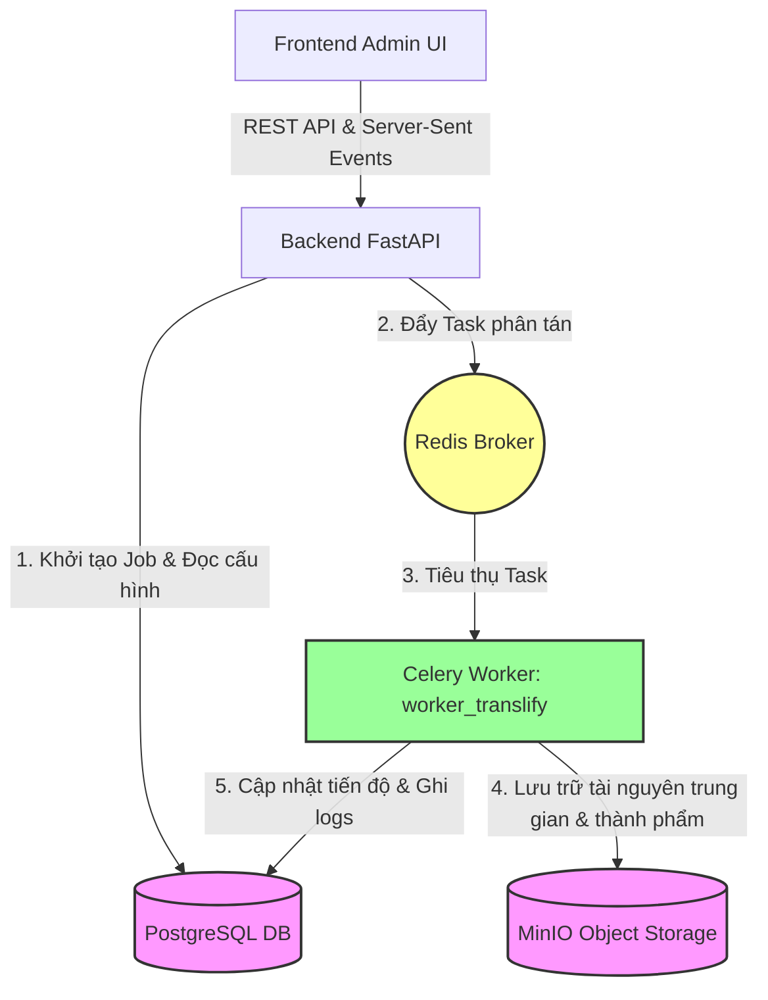
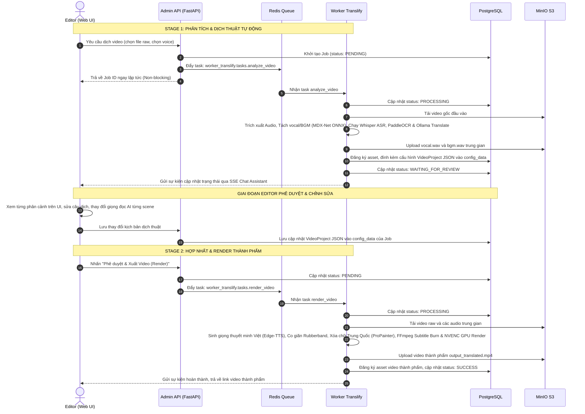
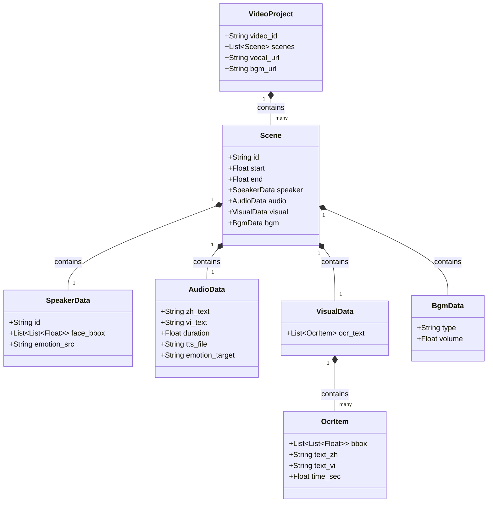

# Kiến Trúc Hệ Thống: Worker Translify (System Architecture)

Hệ thống **Worker Translify** được xây dựng dựa trên kiến trúc **Event-Driven (Kiến trúc hướng sự kiện)** và **Job Queue (Hàng đợi công việc)** bất đồng bộ, tích hợp trực tiếp vào hệ sinh thái của `video-creator-platform`. 

Trọng tâm của thiết kế là mô hình xử lý **Hai giai đoạn (2-Stage Asynchronous Architecture)**, cho phép quản lý vòng đời video dưới dạng cấu trúc dữ liệu chỉnh sửa được (Video-as-Data).

---

## 1. Sơ Đồ Thành Phần Hạ Tầng (Infrastructure Landscape)

Hệ thống Translify tương tác chặt chẽ với 5 thành phần hạ tầng cốt lõi trong hệ thống thông qua các giao tiếp phi chặn (non-blocking):

1. **Frontend Admin UI (Cổng giao tiếp người dùng - port 9173):** Giao diện React giúp người dùng thiết lập tham số dịch thuật, xem và duyệt các câu dịch ở từng scene trước khi render.
2. **Backend API (Bộ điều phối - FastAPI - port 9100):** Cung cấp các endpoint quản lý job, tiếp nhận yêu cầu phân tích video, lưu cấu hình vào PostgreSQL và gửi task vào hàng đợi Redis.
3. **Redis Broker & Job Queue (Hàng đợi công việc - port 6379):** Đóng vai trò là nhà điều phối phân tán, quản lý hàng đợi riêng biệt `translify_queue`.
4. **Celery Worker Node (Bộ xử lý chuyên biệt - GPU/CPU):** Tiến trình nền chạy độc lập trên host machine, tiêu thụ job từ queue, trực tiếp triệu gọi các thư viện deep learning tăng tốc phần cứng qua CUDA.
5. **MinIO Object Storage (Kho lưu trữ đối tượng - port 9000/9001):** Lưu trữ video gốc đầu vào, track âm thanh vocal/BGM được phân tách ở Stage 1, và video Việt hóa kết xuất ở Stage 2.
6. **PostgreSQL Database (Cơ sở dữ liệu - port 5432):** Lưu trữ toàn bộ metadata của Job (`VideoJob`), bảng cấu hình hoạt động của worker (`WorkerConfig`), và liên kết các file thành phẩm (`Asset`, `JobAsset`).

---

## 2. Mô Hình Xử Lý Hai Giai Đoạn Bất Đồng Bộ (2-Stage Async Model)

Để tối ưu hóa tài nguyên phần cứng (vốn rất đắt đỏ đối với các tác vụ Deep Learning/Inpainting) và mang lại khả năng chỉnh sửa linh hoạt cho người dùng, quy trình hoạt động của Translify được chia tách làm hai giai đoạn độc lập:

### A. Stage 1: Phân Tích & Dịch Thuật Bất Đồng Bộ (`analyze_video`)
- **Nhiệm vụ:** Chia video gốc thành các scene logic bằng `PySceneDetect`, tách giọng thuyết minh gốc và nhạc nền qua `audio-separator`, chuyển giọng gốc sang văn bản qua `faster-whisper`, dò tìm tọa độ chữ cứng qua `PaddleOCR`, gọi Ollama dịch thuật toàn bộ sang tiếng Việt, và kiểm tra giới hạn thời lượng (Constraint Checking) để tự động rút gọn câu thoại qua Ollama Rewrite.
- **Lưu trữ dữ liệu:** 
  - File nhạc nền (`bgm.wav`) và giọng gốc (`vocal.wav`) được upload lên MinIO theo đường dẫn có tiền tố `jobs/{job_id}_{video_name_cleaned}/` và được đăng ký vào bảng `assets` của DB để sẵn sàng cho việc tái sử dụng.
  - Toàn bộ kịch bản phân cảnh được đóng gói thành cấu trúc dữ liệu JSON tương thích với Pydantic Schema và ghi đè trực tiếp vào thuộc tính `config_data` của bản ghi `VideoJob` trong PostgreSQL.
- **Kết quả:** Trạng thái Job chuyển thành `WAITING_FOR_REVIEW`.

### B. Duyệt & Chỉnh Sửa Kịch Bản (UI Interaction)
- Hệ thống dừng lại tại bước này, cho phép Editor xem trước bản dịch, cấu trúc từng phân cảnh. Editor có quyền sửa câu thoại tiếng Việt, chọn giọng đọc khác nhau cho từng scene hoặc điều chỉnh âm lượng nhạc nền. Mọi thay đổi đều được lưu trực tiếp vào trường `config_data` trong cơ sở dữ liệu.

### C. Stage 2: Kết Xuất Thành Phẩm (`render_video`)
- **Nhiệm vụ:** Nhận tín hiệu phê duyệt, tải cấu hình `project_data` đã chỉnh sửa từ DB, sinh các đoạn file nói tiếng Việt cục bộ, chạy Rubberband co giãn khớp khít thời gian, chạy module tẩy chữ cứng trên từng frame hình, ghi phụ đề ASS, trộn âm thanh 2 kênh (thoại Việt + nhạc nền gốc đã giảm âm lượng) và render thành video H.264 MP4 sạch.
- **Kết quả:** Upload video thành phẩm lên MinIO, đăng ký liên kết bản ghi asset và chuyển trạng thái thành `SUCCESS`.

---

## 3. Thiết Kế Mô Hình Dữ Liệu Video-as-Data (Pydantic V2 Schema)

Mã nguồn tại [video_schema.py](file:///wsl.localhost/server/root/marketing-video-agent/worker_translify/model/video_schema.py) định nghĩa cấu trúc dữ liệu Video-as-Data cực kỳ nghiêm ngặt giúp chuẩn hóa toàn bộ tài nguyên đa phương tiện trung gian:

### Chi Tiết Cấu Trúc Các Trường
- **`VideoProject`**: Thực thể chứa toàn bộ cấu trúc dự án.
  - `vocal_url` & `bgm_url`: Lưu trữ trực tiếp liên kết MinIO của file vocal và BGM đã được tách lọc ở Stage 1 để editor có thể nghe thử độc lập trên UI.
- **`Scene`**: Định nghĩa một phân cảnh cắt ráp.
  - `start` & `end`: Timestamp bắt đầu và kết thúc cảnh quay trong video gốc (sử dụng để FFmpeg tự động cắt tỉa clip raw).
- **`AudioData`**: Toàn bộ lời thoại của cảnh.
  - `vi_text`: Lời thoại tiếng Việt đã dịch (hoặc đã được editor chỉnh sửa). Đây là đầu vào để sinh giọng nói thuyết minh AI.
  - `duration`: Thời lượng chính xác của phân cảnh để thuật toán Rubberband căn chỉnh tốc độ audio tương ứng.
- **`OcrItem`**: Mô tả hộp chữ cứng Trung Quốc trên màn hình.
  - `bbox`: Lưu trữ tọa độ mảng 4 góc `[[x1,y1], [x2,y2], [x3,y3], [x4,y4]]` biểu diễn đa giác chữ chéo/nghiêng. Đây là đầu vào trực tiếp cho mô hình inpainting ProPainter/LaMa để tẩy sạch vùng chữ này trên hình.
  - `text_vi`: Phụ đề tiếng Việt tương ứng để FFmpeg libass filter đốt cứng lên video sau khi đã tẩy chữ gốc.
