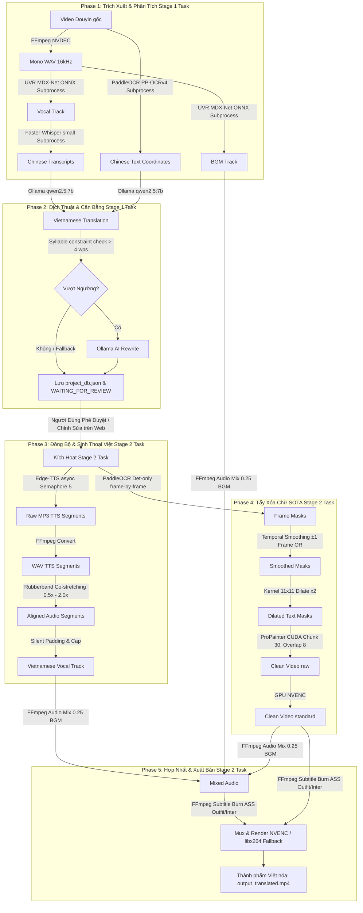

# Luồng Kỹ Thuật Chi Tiết: Worker Translify (End-to-End Pipeline Flow)

Hệ thống **Worker Translify** vận hành dựa trên một chuỗi xử lý (Pipeline) gồm 5 Phase chạy tuần tự khép kín, được tối ưu hóa đặc biệt về tài nguyên GPU và độ ổn định tiến trình.

---

## 1. Sơ Đồ Toàn Bộ Tiến Trình Xử Lý (End-to-End Workflow Pipeline)



---

## 2. Chi Tiết Từng Phase Xử Lý Kỹ Thuật

### PHASE 1: Trích Xuất & Phân Tách Tài Nguyên (Subprocess Isolated)
Để bảo vệ hệ thống khỏi các lỗi rò rỉ bộ nhớ (memory leaks) và chồng lấn tài nguyên khi nạp liên tiếp nhiều mô hình AI học sâu vào VRAM GPU, Phase 1 chạy toàn bộ các tác vụ thông qua các tiến trình phụ cô lập (Isolated Subprocesses) gọi CLI của Python:
1. **FFmpeg NVDEC Audio Demuxing (`phase1_extract.py`):**
   Trích xuất track âm thanh gốc từ video đầu vào bằng lệnh FFmpeg tăng tốc phần cứng GPU `NVDEC` (`-hwaccel cuda`) sang định dạng WAV PCM mono, sample rate 16000Hz (chuẩn nạp của Whisper). Nếu GPU lỗi hoặc thiếu codec, hệ thống tự động sử dụng giải mã CPU làm dự phòng.
2. **Vocal & BGM Separation (`cli_separate_vocals.py`):**
   Khởi chạy một tiến trình con độc lập nạp thư viện `audio-separator`. Nạp mô hình mạng MDX-Net ONNX (`UVR-MDX-NET-Inst_HQ_3.onnx`) trên GPU (tiêu tốn ~1.5GB VRAM) để tách âm thanh gốc thành 2 track riêng biệt: track giọng nói nói (`Vocals`) và track nhạc nền môi trường (`Instrumental`).
3. **Speech-to-Text ASR (`cli_transcribe_whisper.py`):**
   Tiến trình con thứ hai nạp `faster-whisper` với model `small` chạy trên GPU (`compute_type="int8"` để chạy siêu tốc, VRAM ~3GB). Dịch giọng nói Trung Quốc thành chuỗi văn bản kèm mốc thời gian `start` và `end` của từng câu thoại.
4. **On-Screen Text Detection OCR (`cli_paddle_ocr.py`):**
   Trích xuất khung hình video ở tần suất 5 khung hình/giây. Chạy mô hình phát hiện văn bản tiếng Trung `PaddleOCR` (`PP-OCRv4` lang `ch`) để dò tìm tọa độ 4 góc chính xác của hộp chữ xuất hiện trên màn hình.

---

### PHASE 2: Dịch Thuật & Tự Động Viết Lại Cân Bằng Thời Lượng (Self-Healing)
Mục tiêu là biên dịch chuẩn xác sang văn phong Việt Nam bắt trend bán hàng và tự động rút gọn để thoại Việt không bị méo tiếng khi co giãn:
1. **Dịch Thuật Marketing (`phase2_translate.py`):**
   Gửi văn bản lời thoại tiếng Trung và nội dung chữ màn hình OCR đến Ollama cục bộ (`http://localhost:11434/api/chat` chạy model `qwen2.5:7b` độ trễ siêu thấp) theo chế độ dịch đơn dòng (batch_size=1) để đảm bảo khớp khít 100% dòng phụ đề.
2. **Kiểm Tra Giới Hạn Tốc Độ Nói (`constraint_engine.py`):**
   Hệ thống tính toán tốc độ phát âm an toàn của tiếng Việt là **Tối đa 4 từ/giây** (giới hạn sinh lý tự nhiên của tiếng Việt tránh bị líu lưỡi).
   $$\text{max\_words} = \max(1, \text{int}(\text{duration} \times 4.0))$$
3. **Lớp Tự Sửa Lỗi Thống Nhất (Self-Healing Layer):**
   Nếu số từ tiếng Việt lớn hơn `max_words`, hệ thống kích hoạt Ollama gọi model `qwen2.5:7b` viết lại câu dịch siêu ngắn gọn với system prompt ép chặt cấu trúc giới hạn âm tiết nhưng nghiêm cấm đổi nghĩa marketing.
   - *Cơ chế Fallback:* Nếu Ollama không phản hồi kịp thời, hệ thống sử dụng thuật toán cắt chuỗi Python (`" ".join(words[:max_words])`) lấy đúng số từ giới hạn đầu tiên để đảm bảo pipeline không bị tắc nghẽn.

---

### PHASE 3: Đồng Bộ & Sinh Thuyết Minh Bất Đồng Bộ (`phase3_compose.py`)
1. **Tải Voice Concurrent API:**
   Khởi tạo bộ tạo giọng nói `edge-tts` sử dụng cơ chế xử lý bất đồng bộ (`asyncio.gather`). Nhằm tránh bị máy chủ Microsoft chặn IP do gửi quá nhiều yêu cầu đồng thời, hệ thống sử dụng một biến khóa **`asyncio.Semaphore(5)`** để giới hạn tối đa chỉ có 5 luồng tải MP3 song song tại một thời điểm.
2. **Chuyển Đổi & Đo Đạc Tần Số:**
   Chuyển đổi các file MP3 tải về sang định dạng WAV PCM mono 16kHz thông qua FFmpeg. Đo thời lượng thực tế của file âm thanh tiếng Việt được sinh ra (`actual_dur`).
3. **Rubberband Co-stretching:**
   Tính toán tỷ lệ co giãn $\text{ratio} = \frac{\text{actual\_dur}}{\text{scene\_dur}}$ (trong ngưỡng an toàn `[0.5x, 2.0x]`). Nếu tỷ lệ lệch quá 5%, hệ thống triệu gọi thư viện chất lượng cao **Rubberband** để co giãn tần số âm thanh, giữ nguyên cao độ/pitch gốc của giọng nói tiếng Việt (tránh giọng sóc chuột méo mó).
4. **Silent Padding & Capping:**
   Cắt bỏ phần dư thừa hoặc bù thêm khoảng lặng (silent padding) vào cuối đoạn WAV để đảm bảo file âm thanh thoại tiếng Việt khớp chính xác 100% đến từng phần nghìn giây với thời lượng của phân cảnh.

---

### PHASE 4: Tẩy Xóa Chữ SOTA Inpainting (`propainter_inpaint.py`)
Tẩy chữ cứng không tì vết (không tạo vệt mờ nhòe blur như các công cụ rẻ tiền) là điểm vượt trội nhất của Translify:

```
[Frame i] ──> PaddleOCR Det-only ──> [Mask nhị phân]
                                           │
                                  (Logical OR ±1 frame) ──> [Smoothed Mask] ──> Dilation 11x11 ──> ProPainter CUDA
```

1. **Lazy det-only bypass REC (`render_engine.py`):**
   Nạp PaddleOCR ở chế độ lazily-cached chỉ phát hiện biên chữ (`rec=False`, không nhận dạng chữ). Giúp bỏ qua bước tải mô hình tiếng Trung Rec không cần thiết từ máy chủ Trung Quốc, khởi tạo model cực nhanh trong 3 giây.
2. **Mặt Nạ Khớp Khít Từng Frame (Pixel-perfect frame detection):**
   Chạy phát hiện tọa độ chữ trực tiếp trên mảng numpy frame trong bộ nhớ GPU bằng lệnh `model.ocr(frame, rec=False)`. Bỏ qua hoàn toàn việc ghi/đọc file đĩa trung gian giúp tối ưu hóa hiệu suất tối đa.
3. **Temporal Mask Smoothing (Liên kết ±1 frame):**
   Để đối phó với hiện tượng chữ nhấp nháy (flickering mask) khi camera di chuyển hoặc chữ chuyển động nhanh, hệ thống lấy mask của frame $i$ kết hợp toán tử logical OR với hai frame liền kề ($i-1$ và $i+1$).
4. **Generous Dilation (Giãn nở mặt nạ biên):**
   Co giãn mặt nạ bằng kernel kích thước lớn $11 \times 11$ với `iterations=2` để che phủ hoàn chỉnh toàn bộ bóng mờ biên chữ (antialiased edges) và bóng đổ (drop shadows).
5. **ProPainter Chunking & Blending:**
   - Để GPU RTX 4060 Ti 16GB không bị sập CUDA OOM, video được phân mảnh thành các block `chunk_size = 30` khung hình, độ gối đầu `overlap = 8` khung hình.
   - Chạy inpainting lan truyền dòng quang học của ProPainter trên GPU CUDA.
   - Vùng overlap gối đầu được pha trộn tinh tế bằng `cv2.addWeighted` với hệ số alpha tuyến tính.
   - Giải phóng bộ nhớ GPU triệt để sau mỗi scene:
     ```python
     gc.collect()
     torch.cuda.empty_cache()
     ```

---

### PHASE 5: Hợp Nhất & Kết Xuất Video Thành Phẩm (`phase3_compose.py`)
1. **Audio Mixing (Trộn âm 2 kênh):**
   Sử dụng bộ lọc `amix` của FFmpeg để giảm nhạc nền gốc (`bgm.wav`) xuống mức âm lượng `0.25` và trộn đè track thuyết minh tiếng Việt (`voice_viet.wav`) lên kênh chính để làm nổi bật lời thoại Việt.
2. **Burn Phụ Đề ASS Động Nghệ Thuật (`subtitle_utils.py`):**
   Đóng gói phụ đề tiếng Việt thành file ASS nghệ thuật sử dụng font chuyên dụng **Outfit** (font chữ tiếng Việt hiện đại cho lời thoại chính) và **Inter** (cho các tiêu đề caption trên cao). Sử dụng FFmpeg `ass` filter để đốt cứng (burn) phụ đề vào video.
3. **Tăng Tốc Mã Hóa GPU NVENC & CPU Fallback:**
   Mã hóa xuất video MP4 H.264 tốc độ cao sử dụng card NVIDIA GPU qua codec `h264_nvenc` với profile chất lượng cao (`-preset p5`, `-rc vbr`, `-cq 20`).
   - *Cơ chế Fallback an toàn:* Nếu GPU bị chiếm dụng hoặc môi trường chạy thiếu Driver NVENC, hệ thống tự động chuyển sang mã hóa CPU bằng codec `libx264` (`-preset veryfast`, `-crf 20`) để đảm bảo luôn kết xuất video thành công.

---

## 3. Cơ Chế Khôi Phục Vận Hành Khi Gặp Sự Cố (Work Recovery)

Render deep learning inpainting là tác vụ cực kỳ nặng. Để tránh việc phải render lại từ đầu khi hệ thống gặp sự cố mất điện hoặc crash giữa chừng, Translify thiết lập tính năng **Work Recovery** thông minh tại [render_engine.py](file:///wsl.localhost/server/root/marketing-video-agent/worker_translify/translify_engine/render_engine.py#L339-L352):

```python
scene_final_mp4 = os.path.join(scene_dir, "scene_final.mp4")
if os.path.exists(scene_final_mp4) and os.path.getsize(scene_final_mp4) > 0:
    mtime = os.path.getmtime(scene_final_mp4)
    dt = datetime.datetime.fromtimestamp(mtime)
    cutoff = datetime.datetime(2026, 5, 21, 20, 0, 0)
    if dt > cutoff:
        logger.info(f"[{scene.id}] Already rendered in the high-quality run ({dt}). Reusing {scene_final_mp4}")
        scene_files.append(scene_final_mp4)
        continue
```

- Trước khi tiến hành render một phân cảnh (`Scene`), hệ thống kiểm tra xem file `scene_final.mp4` đã tồn tại trong thư mục scene tương ứng hay chưa và đo đạc timestamp sửa đổi cuối cùng (`mtime`).
- Nếu file được ghi nhận tạo ra sau mốc thời gian an toàn (Cutoff time, mặc định là sau phiên khởi động chạy chất lượng cao `2026-05-21 20:00:00`), hệ thống sẽ **bỏ qua ngay lập tức** toàn bộ luồng xử lý inpaint & sinh thoại của cảnh đó và đưa trực tiếp clip cũ vào danh sách ghép nối.
- Tiết kiệm lên tới hơn **90% thời gian** chạy lại nếu hệ thống bị dừng đột ngột ở những giây cuối của video.
