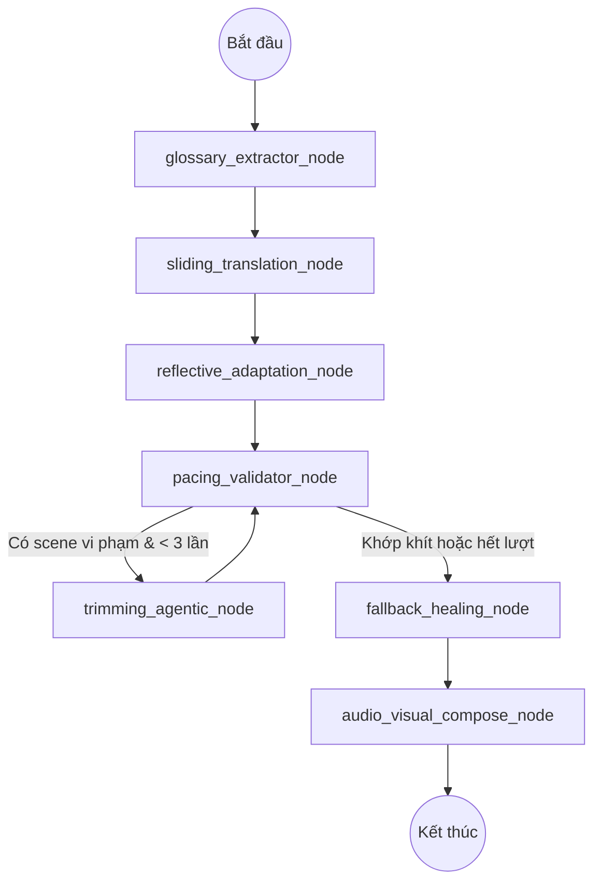

# Kế Hoạch Nâng Cấp Hệ Thống: Động Cơ Agentic LangGraph Translify Workflow (SOTA)

Bản kế hoạch này đặc tả thiết kế kiến trúc nâng cấp hệ thống **Worker Translify** từ luồng xử lý tuyến tính (Pipeline) sang **Đồ thị Agent tự trị (Agentic LangGraph Workflow)**. 

Bản thiết kế này tích hợp các kỹ thuật phản hồi (Reflection), tự sửa lỗi (Self-healing), dịch thuật đa ngữ cảnh (Context-Aware) lấy cảm hứng từ **VideoLingo**, nhưng được **tối ưu hóa hoàn chỉnh cho video ngắn 9:16** bằng cách giữ nguyên tính tối thượng của phân cảnh hình ảnh (Scene-First Approach) và loại bỏ hoàn toàn sự cồng kềnh của SpaCy NLP để tránh phá vỡ đồng bộ hình-tiếng.

---

## 1. Tại Sao Lựa Chọn Kiến Trúc LangGraph Cho Translify Engine?

Việc sử dụng kịch bản tuyến tính từ trên xuống dưới (Linear Pipeline) gặp phải các giới hạn lớn về độ linh hoạt:
- **Thiếu phản hồi tự sửa lỗi (Self-healing Cycles):** Khi một câu dịch tiếng Việt bị quá dài, hệ thống cũ chỉ có thể chạy một hàm rewrite thô sơ 1 lần hoặc cắt chuỗi bằng Python. Sử dụng LangGraph cho phép ta định nghĩa các **vòng lặp hiệu chỉnh (explicit cycles)**: LLM tự sửa lại câu dịch dựa trên báo lỗi cụ thể của Python Validator cho đến khi khớp khít thời lượng.
- **Loại bỏ thảm họa JSON-in-JSON:** Tương tự như AI Leader Agent, việc nạp và cập nhật cấu hình `VideoProject` phức tạp qua các Framework Agent thông thường rất dễ gây lỗi cú pháp. LangGraph cho phép định nghĩa một **State Schema** rõ ràng và bóc tách dữ liệu bằng Regex an toàn tuyệt đối.
- **Tách biệt vai trò rõ rệt (Routing & Nodes):** Phân chia rõ ràng giữa các bước tính toán logic bằng Python thuần túy (Validator, Audio-Stretching) và các bước suy luận AI (Glossary Extractor, Translator, Trimming Agent).

---

## 2. Loại Bỏ SpaCy NLP - Bảo Vệ Tính Tối Thượng Của Phân Cảnh (Scene-First Approach)

Chúng tôi quyết định **loại bỏ hoàn toàn đề xuất sử dụng SpaCy NLP để chia lại câu thoại** vì các lý do thực tế sau:
1. **Video ngắn 9:16 yêu cầu đồng bộ hình ảnh tuyệt đối:** Khác với video hội thoại dài (YouTube talks), video marketing ngắn 9:16 phụ thuộc cực kỳ chặt chẽ vào các nhát cắt hình ảnh (visual cuts) được phát hiện bởi `PySceneDetect`.
2. **Tránh lỗi tràn chữ sang cảnh sau (Subtitle Bleeding):** Nếu sử dụng NLP để phân đoạn lại câu thoại qua ranh giới cảnh, phụ đề tiếng Việt sẽ bị kéo dài sang cảnh kế tiếp trong khi nhân vật đã dừng nói hoặc cảnh phim đã chuyển sang sản phẩm khác.
3. **Giải pháp tối ưu:** Giữ nguyên cấu trúc phân cảnh (`scenes`) được cắt theo hình ảnh và timestamps chính xác từ Whisper làm ranh giới bất biến (Sacred Boundaries). Toàn bộ luồng Agentic LangGraph dưới đây sẽ chỉ thực hiện suy luận, dịch thuật, hiệu chỉnh và rút gọn **bên trong ranh giới của từng phân cảnh độc lập**, bảo toàn 100% sự đồng bộ khẩu hình và chuyển cảnh.

---

## 3. Thiết Kế Đồ Thị Agent Tự Trị (Translify LangGraph Architecture)

Celery worker khi nhận task `process_video` hoặc `analyze_video` sẽ khởi tạo và thực thi đồ thị LangGraph dưới dạng phi trạng thái (Stateless Graph):

### 3.1. Đối Tượng Trạng Thái (Translify Agent State)
Sử dụng `TypedDict` để quản lý thông tin trạng thái trôi chảy trong Graph:
*   `original_video_path`: Đường dẫn video raw.
*   `project_data`: Thực thể `VideoProject` (chứa danh sách `Scene`).
*   `glossary`: Bảng từ vựng dịch thuật chuyên dụng được chiết xuất.
*   `theme_summary`: Tóm tắt 2 câu về chủ đề cốt lõi của video.
*   `pacing_violations`: Danh sách các ID Scene bị vi phạm giới hạn tốc độ nói (> 4.0 từ/giây).
*   `trimming_attempts`: Dict lưu số lần đã cố gắng yêu cầu LLM sửa nhịp độ của từng Scene (tối đa 3 lần/scene).

### 3.2. Sơ Đồ Luồng Hoạt Động Của Đồ Thị (LangGraph Workflow)



---

## 4. Chi Tiết Các Nút Xử Lý Kỹ Thuật (Graph Nodes Spec)

### Node 1: `glossary_extractor_node` (LLM)
- **Nhiệm vụ:** Quét toàn bộ transcript tiếng Trung thô của video gốc.
- **Suy luận:** Gọi Ollama (`qwen2.5:7b`) phân tích chủ đề cốt lõi (Theme) và chiết xuất ra một **bảng thuật ngữ chuyên dụng (Glossary)** gồm các danh từ riêng, tên sản phẩm, thương hiệu hoặc từ khó kèm nghĩa dịch tiếng Việt đề xuất.
- **Đầu ra:** Ghi `glossary` và `theme_summary` vào State để làm neo định hướng cho tất cả các bước dịch sau.

### Node 2: `sliding_translation_node` (LLM)
- **Nhiệm vụ:** Dịch thuật chuyên sâu dòng thoại tiếng Trung của từng phân cảnh sang tiếng Việt.
- **Suy luận:** Dịch tịnh tiến trượt (Sliding Window Chunks) với kích thước block 600 ký tự. Để đảm bảo tính trôi chảy, nạp kèm ngữ cảnh: 3 dòng thoại của phân cảnh trước và 2 dòng thoại của phân cảnh sau làm lề biên, kết hợp nạp bảng thuật ngữ Glossary để xưng hô đồng nhất.
- **Đầu ra:** Bản dịch tiếng Việt trực tiếp (Faithful Direct Translation) cho từng scene.

### Node 3: `reflective_adaptation_node` (LLM)
- **Nhiệm vụ:** Hiệu chỉnh bản dịch thô sang văn phong Việt hóa tự nhiên.
- **Suy luận:** LLM đóng vai trò là Biên tập viên bản địa hóa, phản hồi về độ conciseness (ngắn gọn), điều chỉnh từ lóng, đại từ nhân xưng phù hợp với sắc thái campaign (casual, tutorial, giật gân bán hàng) mà không làm lệch timeline.
- **Đầu ra:** Bản dịch Việt hóa mượt mà (Free Translation).

### Node 4: `pacing_validator_node` (Python)
- **Nhiệm vụ:** Đo đạc nhịp độ phát âm tiếng Việt.
- **Logic:** Tính toán số từ tiếng Việt của phân cảnh so với thời lượng thực tế của cảnh đó. 
- **Đầu ra:** Phát hiện các scene có tốc độ nói vượt quá **4 từ/giây** (duration violation) và cập nhật vào danh sách `pacing_violations` trong State. 
  - *Conditional Edge:* Nếu danh sách trống hoặc tất cả các scene vi phạm đã chạm ngưỡng 3 lần thử (`trimming_attempts[scene_id] >= 3`), rẽ nhánh sang `fallback_healing_node`. Ngược lại, rẽ nhánh sang `trimming_agentic_node`.

### Node 5: `trimming_agentic_node` (LLM Agent - Vòng lặp tự sửa lỗi)
- **Nhiệm vụ:** Tự động sửa lỗi nhịp độ chữ cho các scene bị vi phạm.
- **Suy luận:** LLM đóng vai trò là "Subtitle Trimmer Agent", nhận đầu vào là câu thoại tiếng Việt đang bị dài và thời lượng tối đa cho phép. LLM tự động tối ưu hóa câu từ theo các quy tắc khắt khe:
  - Lược bỏ từ đệm, từ tình thái dư thừa (*nha, nhé, quả thật*).
  - Viết gọn cụm trạng từ/tính từ mà không đổi nghĩa danh từ/động từ chính.
- **Đầu ra:** Cập nhật câu dịch mới đã rút gọn vào kịch bản, tăng `trimming_attempts[scene_id]` lên 1 đơn vị, và đẩy ngược lại Node Validator để tái thẩm định.

### Node 6: `fallback_healing_node` (Python - Lưới an toàn)
- **Nhiệm vụ:** Lưới đỡ an toàn đảm bảo pipeline không bao giờ bị crash hoặc treo vô hạn (Anti-hang fallback).
- **Logic:** Đối với các scene đã thử sửa 3 lần nhưng LLM vẫn cứng đầu sinh câu quá dài, Python Healer tự động can thiệp bằng cách:
  - Cắt chuỗi vật lý lấy đúng số từ giới hạn an toàn từ trái sang.
  - Tự động điều chỉnh nới rộng nhẹ thời lượng phát âm của scene đó (nếu cấu hình hệ thống cho phép) để khớp khít khẩu hình.
- **Đầu ra:** Kịch bản JSON sạch lỗi nhịp độ chữ, sẵn sàng kết xuất.

### Node 7: `audio_visual_compose_node` (Python/GPU)
- **Nhiệm vụ:** Thực thi sinh audio, inpaint hình ảnh và kết xuất thành phẩm.
- **Logic:** Chạy song song sinh Edge-TTS, co giãn Rubberband giữ tông giọng nói, chạy ProPainter CUDA xóa chữ theo block trượt, trộn nhạc nền 0.25 volume, burn phụ đề ASS Outfit/Inter và render GPU NVENC.
- **Đầu ra:** Video Việt hóa hoàn mỹ xuất lên MinIO.

---

## 5. Lộ Trình Phát Triển Chi Tiết Cho Developers (Upgraded Roadmap)

### Giai đoạn 1: Khởi Tạo Graph & Thư Viện LangGraph
1. Cài đặt gói `langgraph` và `langchain-openai` vào môi trường ảo của worker.
2. Tạo cấu trúc thư mục mới: `worker_translify/translify_graph/` chứa:
   - `state.py` (Định nghĩa `TranslifyAgentState`).
   - `nodes.py` (Định nghĩa các hàm thực thi cho 7 Nodes).
   - `graph.py` (Xây dựng, liên kết các Nodes và các Cạnh điều kiện `Conditional Edges`).

### Giai đoạn 2: Cài Đặt Lớp Validator & Trimming Agent
1. Port logic kiểm tra nhịp độ nói từ `constraint_engine.py` sang `nodes.py` làm `pacing_validator_node`.
2. Thiết lập Agentic Trimming Prompt chuyên dụng trong `nodes.py` để LLM tự động lược bỏ từ đệm, trạng từ bổ nghĩa dư thừa.

### Giai đoạn 3: Tích Hợp Vào Celery Task
1. Cập nhật `celery_worker.py` để các task `process_video` và `analyze_video` triệu gọi và chạy đồ thị LangGraph thông qua câu lệnh:
   ```python
   graph = compile_translify_graph()
   final_state = graph.invoke(initial_state)
   ```
2. Lưu trữ log di chuyển giữa các nút của Graph vào bảng `JobLog` để người dùng theo dõi tiến trình Agent đang suy luận thời gian thực trên Web UI.
